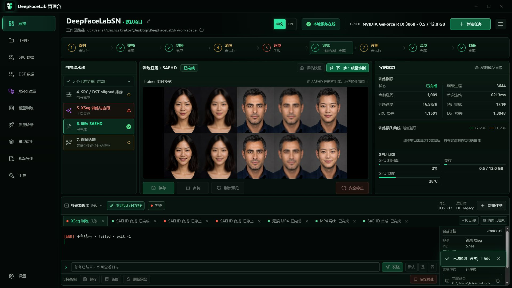
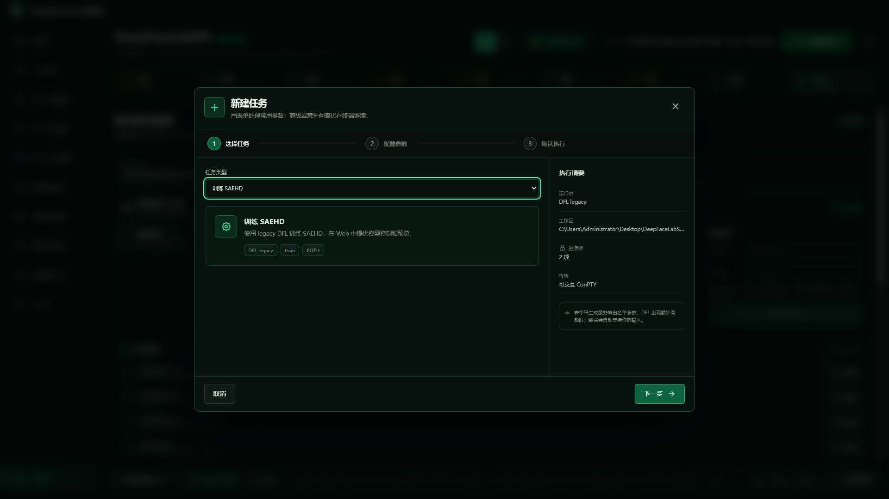
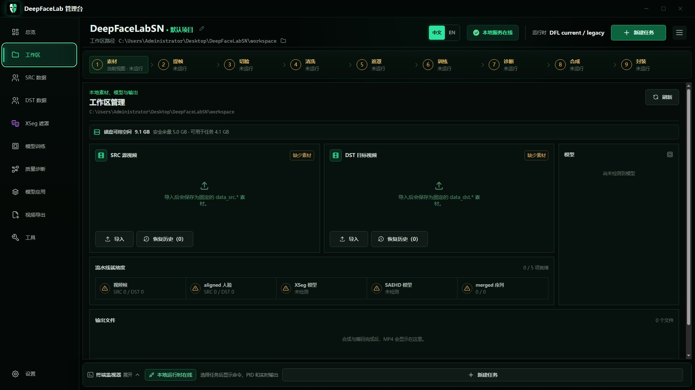
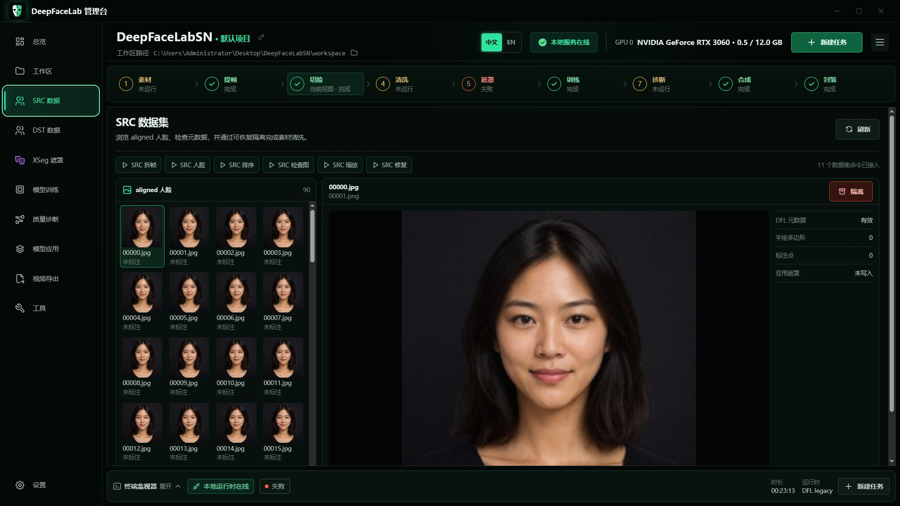
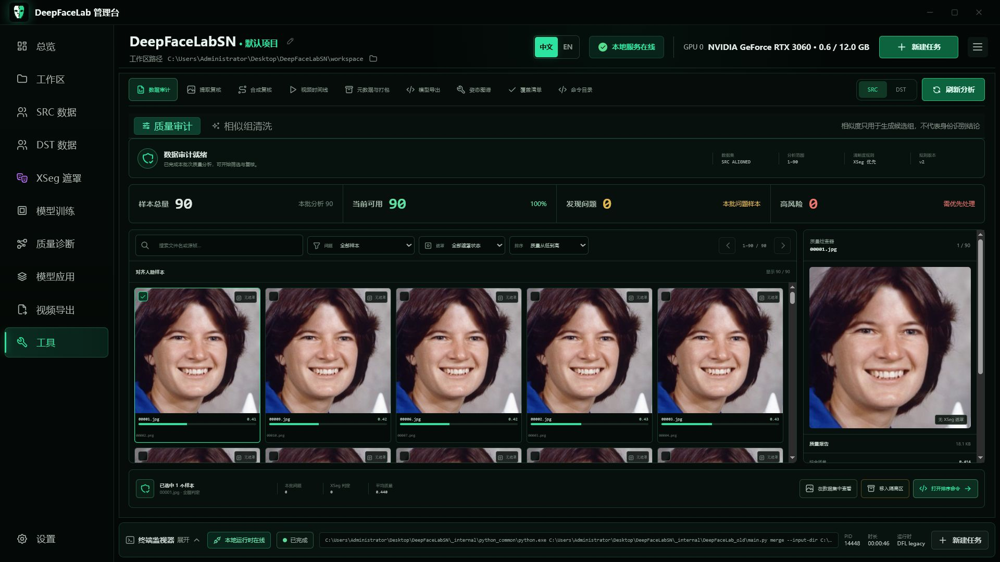
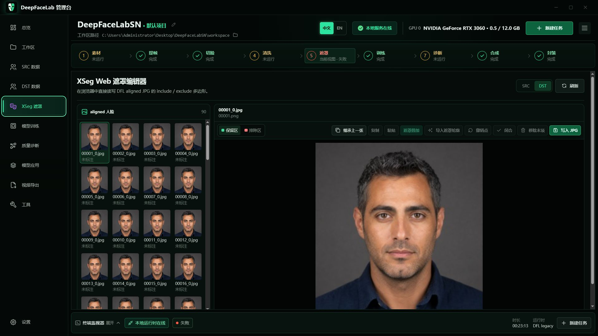
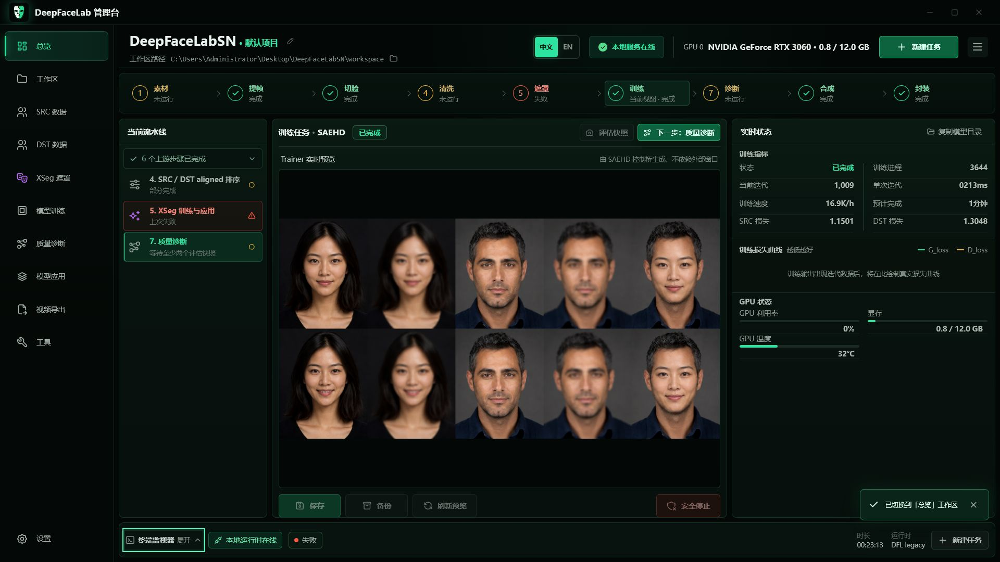
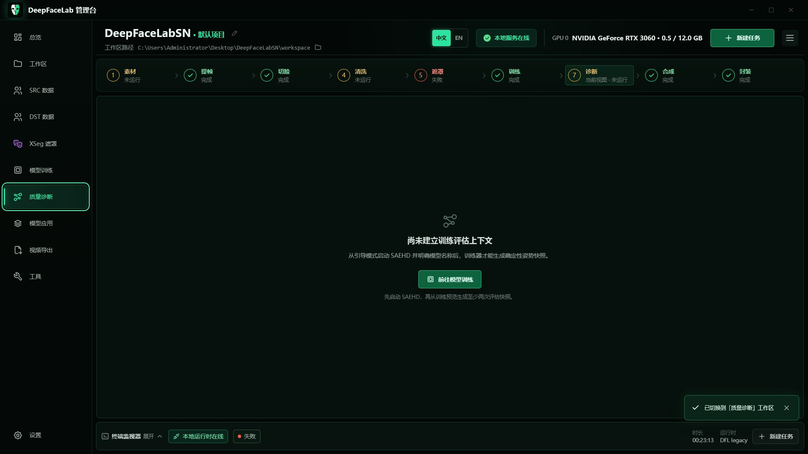
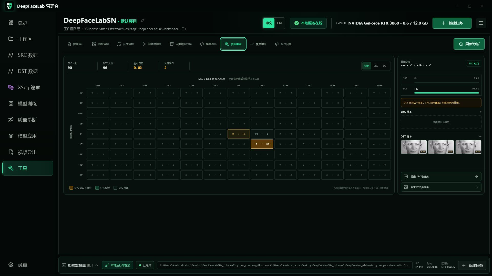
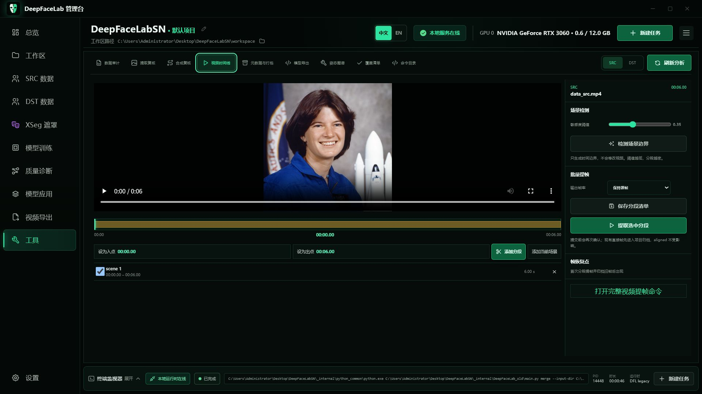

# DeepFaceLabSN

DeepFaceLabSN 是一套面向 Windows 与 NVIDIA GPU 的本地 DeepFaceLab 工作台。它把素材整理、提帧、切脸、质量检查、XSeg、训练、模型诊断、合成和视频导出放进同一条可视化流程；命令仍在本机运行，素材不会因为使用 WebUI 而上传到云端。

> 请只处理你拥有或已获授权的素材，并遵守适用的隐私、肖像权和内容标识规定。

本手册与演示工作区中的人物均为文生图生成的虚构成年人，不对应真实公众人物或可识别个人。生成提示词和资产说明见 [虚拟身份演示素材](docs/demo-assets/fictional-identities/README.md)。下列界面图均取自当前 WebUI 的 1920 × 1080 中文界面；Trainer 区域只展示真实训练输出，未运行训练时保持空状态。



## 下载与启动

- 最新整合包：[夸克网盘](https://pan.quark.cn/s/e1a677c7d8a7)
- 更新日志：[Monster 社区](https://bbs.monster/thread-692-1-1.html)
- 推荐环境：Windows 10/11、NVIDIA GPU、足够的显存与磁盘空间


### 单文件下载启动器

仓库现已提供轻量原生启动器的构建源码。发布产物只有一个
`DeepFaceLabSN.Launcher.exe`；它内嵌首次配置页、常态启动页、依赖引导脚本、
WebView2 宿主和 ConPTY 终端桥，不需要把 DLL 或前端文件放在 EXE 旁边。

如果系统缺少 Microsoft Edge WebView2 Runtime，EXE 会先显示不依赖 WebView2
的原生安装窗，只从 Microsoft 官方地址下载安装器，校验 Authenticode 签名后静默
安装并自动继续。

首次运行时，启动器会在用户选择的空目录中完成以下工作：

1. 准备经过 SHA-256 校验的便携 MinGit，并从固定 GitHub 地址克隆 `main`。
2. 把 Node.js 安装到 `_internal/node`。
3. 从 NVIDIA 官方可再发行归档中提取所需 DLL 到 `_internal/CUDA` 与 `_internal/CUDNN`。
4. 从官方 CPython 与固定 PyPI wheel 构建并验证 `_internal/python_common`，随后安装 WebUI 依赖。
5. 进入常态界面；可启动 WebUI，也可直接使用内嵌的传统 BAT 交互终端。

所有运行时和镜像配置都保存在项目内，不修改系统 PATH，也不写用户全局 npm/pip
配置。自动模式会优先探测国内 npm、pip 与 Node 镜像，失败后回退官方源；每个下载
文件仍必须通过清单中的固定 SHA-256。

> **Python 运行时：** 当前清单已启用可复现 wheelhouse：官方 CPython 3.7.1、
> 97 个固定 wheel 与 1 个经 SHA-256 校验的源码包。下载阶段优先使用清华 PyPI 镜像，
> 失败后回退官方文件源；安装阶段强制 `--no-index --no-deps`，不会临时解析新版依赖。
> 已有且通过完整文件、版本和导入校验的 `_internal/python_common` 会直接复用。
> 锁定清单、安全边界与维护流程见 `launcher/python-runtime/README.md`。

“检查项目更新”只执行安全检查与 `fetch`。用户确认安装后才执行
`merge --ff-only origin/main`；检测到源码改动、分支分叉、错误远端或远端包含受保护
路径时会停止，不会自动运行 `stash`、`reset` 或 `clean`。`workspace`、`workspaces`、
模型、`_internal/config.txt` 与项目本地运行时不会被更新覆盖。

构建命令：

```powershell
powershell.exe -NoProfile -ExecutionPolicy Bypass -File launcher\build-host.ps1
```

首次使用只需五步：

1. 解压整合包，尽量使用短路径和纯英文目录。
2. 双击 `启动 WebUI.bat`。
3. 浏览器打开后，确认顶部显示“本地服务在线”，并能识别 GPU。
4. 打开“工作区”，分别导入 SRC 源视频与 DST 目标视频，并核对预览、时长和分辨率。
5. 点击“新建任务”，按“选择任务 → 配置参数 → 确认执行”三步向导运行提帧、训练或导出任务。

启动器会优先使用整合包内的便携 Node.js 24。若运行时缺失或版本不兼容，会自动从整合包内置的离线安装包补齐；离线安装包也不存在时，才从 Node.js 官方站下载并校验 SHA-256。整个过程不需要管理员权限，也不会修改系统 PATH。首次使用精简版整合包时需要联网下载约 37 MB。



如果 WebUI 无法启动，可使用 `传统命令菜单.bat` 进入兼容菜单。传统 BAT 已集中到 `legacy-cli`，日常使用不需要运行初始化 BAT。

## 先理解 SRC 与 DST

| 名称 | 含义 | 选择建议 |
| --- | --- | --- |
| SRC | 提供要替换进去的身份与脸部特征 | 光线清楚、角度丰富、遮挡少、表情覆盖充分 |
| DST | 提供最终视频中的动作、表情、镜头和身体 | 使用最终要制作的视频，优先保证画面稳定、分辨率一致 |

工作区会直接预览两段素材并显示时长、分辨率、大小和修改时间；同时汇总视频帧、aligned 人脸、XSeg、训练模型、merged 序列和输出文件的就绪状态。导入错误时先在这里更换，不必进入后续步骤再返工。“归档已完成任务”只整理已结束任务的日志，不会删除素材、模型或输出。



## 完整工作流

顶部“项目流程”既是进度概览，也是页面导航。点击任一步骤即可进入对应功能。

界面分为三层：左侧栏按功能域切换页面，顶部流程按制作顺序导航，底部终端标签是任务队列与日志的唯一入口。终端折叠后仍固定在窗口底部，已结束会话可隐藏、关闭或恢复，不会无限堆积。后台任务统一显示在右下角悬浮进度卡中，因此进度条出现或消失不会挤动主界面。

状态颜色保持统一：亮绿表示正在运行，绿色表示完成，琥珀色表示等待或需要留意，红色表示失败；紫色只用于 XSeg 功能识别。当前查看的流程步骤会保留自身真实状态，并增加轮廓提示，不会把“正在查看”误写成“正在运行”。

| 阶段 | 要做什么 | 完成标准 |
| --- | --- | --- |
| 1 素材 | 导入并核对 SRC / DST | 视频可预览，路径与基础信息正确 |
| 2 提帧 | 把视频拆成帧 | `data_src` 与 `data_dst` 中产生帧图 |
| 3 切脸 | 检测、对齐并提取人脸 | aligned 目录出现清晰、方向正确的人脸 |
| 4 清洗 | 审计模糊、遮挡、重复和异常样本 | 问题样本已隔离或确认保留 |
| 5 遮罩 | 训练并应用 XSeg | 关键边界和遮挡区域覆盖正确 |
| 6 训练 | 训练 SAEHD 等模型 | 预览持续改善，损失与显存状态正常 |
| 7 诊断 | 对比训练快照，检查质量回归 | 至少保存两个可比较的评估快照 |
| 8 合成 | 将模型应用到 DST 人脸 | 合成帧边缘、颜色和遮挡可接受 |
| 9 封装 | 把合成帧与音频导出为视频 | MP4 可播放，时长和音轨正确 |

### 1. 提帧、切脸与清洗

先完成 SRC，再完成 DST。切脸后可在“SRC 数据”与“DST 数据”逐张管理 aligned 人脸：左侧缩略图列表会随可用宽度增加列数，右上角 `− / +` 可调整每行数量；右侧保持固定宽度的 1:1 大图预览，并可叠加 DFL 定位、手绘多边形、标注点和应用遮罩图层。

“隔离”和“恢复区”位于数据集命令栏右侧。恢复区与工作区采用相同的“缩略图列表 + 大图属性”结构，可先隔离问题样本再复核恢复。大图下方还提供 XSeg 编辑入口，以及处于“规划中”的清晰增强、单图合成和 AI 图像编辑入口。



进一步进入“工具 → 数据审计”，可按清晰度、曝光、重复、姿态与遮罩状态筛选。审计页会显示样本总量、可用数量、问题数量和高风险数量，并允许逐张检查原图、质量指标、源帧、遮罩判定和姿态信息。



### 2. XSeg 遮罩

当头发、手、眼镜、麦克风或复杂背景穿过脸部边界时，XSeg 能显著改善合成边缘。编辑器沿用数据集页面的布局原则：左侧管理样本，右侧 1:1 画布按剩余高度铺满；保留区、排除区和写入按钮置顶，继承、复制、粘贴、导入、撤销、闭合与移除操作贴底。先标注少量有代表性的 SRC / DST 样本，训练 XSeg，再回到编辑器复核覆盖效果。

未闭合多边形不会被写入 JPG；刷新、切换素材、切换页面或关闭窗口前若有未保存修改，界面会请求确认，避免静默丢失标注。



### 3. 模型训练

“模型训练”页集中列出 SAEHD、XSeg、ME、Quick384 和 Quick512 五个入口，并标明使用 DFL legacy 还是 DFL current。点击模型后仍通过统一的三步任务向导配置参数；SAEHD 提供 Web 控制桥，ME、Quick384 与 Quick512 的完整 DFL 问答保留在底部终端。

训练真正运行后，“总览”才会显示 Trainer 生成的真实预览，以及迭代、速度、SRC / DST 损失、显存、温度和损失曲线。没有运行中的训练时预览区保持明确的空状态，不使用演示图冒充训练结果。首次只想验证流程时，可在 DFL 问答中选择较低模型分辨率（例如 128）；正式项目再根据显存、脸部占比和目标质量逐步提高。



训练期间建议：

- 先确认预览中的 SRC、DST 和转换结果方向正确，再长时间运行。
- 定期保存模型和评估快照；安全停止会在退出前请求保存。
- 百分比、已处理数量或可推导总量的任务会显示真实进度和预计剩余时间；无法推导总量时会明确显示“处理中”，不会伪造百分比。
- 显存不足时，优先降低 batch size、模型分辨率或网络维度，不要同时大幅修改多个参数。

### 4. 姿态图谱与训练诊断为什么要并存

两者职责不同，不能互相替代：

- **姿态图谱**检查训练数据是否覆盖正脸、侧脸、抬头和低头，以及 SRC 与 DST 的姿态分布是否匹配。它主要回答“训练前的数据够不够、缺哪类角度”。
- **训练诊断**在相同模型、评估清单、指标版本和模型结构下比较两个训练快照。它主要回答“继续训练后是否真的变好，是否出现锐度、身份、遮罩或颜色回归”。

回归比较至少需要四个稳定条件：同一模型身份、同一评估样本清单、同一指标版本、同一网络结构。任一条件变化，都应建立新的比较基线。

尚未建立训练评估上下文时，诊断页会直接说明缺少的前置条件，并提供返回模型训练的入口，避免新手面对空白页面。





### 5. 合成与视频导出

完成训练诊断后再进入“模型应用”。先生成少量合成帧检查边缘、肤色、遮挡和运动稳定性，再运行全量合成。最后在“视频导出”中封装 MP4，并核对音频、帧率与时长。

长视频可在“工具 → 视频时间线”中按场景拆分处理，减少失败后的重跑范围。



## 常用工具

“工具”页补充主流程之外的复核和修复能力：

- 数据质量审计：筛查模糊、遮挡、重复、异常姿态与遮罩问题。
- 提取覆盖复核：确认视频各时间段和角度都有足够人脸样本。
- 合成复核：以 SRC、DST、合成结果三联画检查质量。
- 视频时间线：场景识别、分段提帧、失败片段重跑。
- 元数据与打包：检查 DFL 图片元数据和 PackedFaceset。
- 模型导出：DFM 导出前检查模型、空间和依赖条件。
- 姿态图谱与覆盖清单：定位 SRC / DST 中缺少的角度与表情。
- 图像工具：清晰增强、单图合成和 Gemini / GPT Image 临时编辑的界面入口；当前明确标记为“规划中”，不会伪装成已完成能力。
- 命令目录：查看 WebUI 允许执行的固定命令及其用途。

需要 DFL GPU 实时交互的 Manual Extractor 与 Interactive Merger，会先进入可视化预检，再接力到固定 Python 命令。WebUI 不开放任意 Shell。

## 进度、日志与失败恢复

- 右下角悬浮进度卡优先显示真实百分比、当前步骤、已处理数量和预计剩余时间；无法推导总量时明确显示“处理中”，不会伪造百分比。
- 底部终端保留 DFL 原始输出；程序等待参数时，可直接在终端输入并发送。终端标签同时承担任务队列，已结束会话可关闭、隐藏和恢复。
- 任务失败时先阅读失败原因和建议动作，再查看完整日志。不要在任务仍运行时强制关闭窗口。
- “安全停止”适用于训练等长任务；已完成的模型和中间文件仍保留在工作区。

## 常见问题

**顶部显示“本地服务离线”怎么办？**

关闭残留窗口后重新运行 `启动 WebUI.bat`。仍失败时检查端口占用、防火墙和整合包路径，再查看启动窗口中的首条错误。

**导入后看不到人脸？**

先确认提帧目录有图像，再检查人脸检测器、脸型和最小尺寸设置。极端侧脸、强遮挡或低清素材可能需要手动提取。

**诊断页提示没有可比较快照？**

在训练页用同一评估样本至少保存两个不同时间点的快照，再返回诊断页比较。

**Trainer 预览长时间不更新？**

先看终端是否正在等待输入，再检查训练进程、显存和模型目录。点击“刷新预览”不会中断训练。

**Trainer 区域为什么是空的？**

这是正常的空闲状态。WebUI 只显示 Trainer 实际生成的预览；先从“模型训练”启动 SAEHD，任务进入运行状态后再回到“总览”查看。

**合成结果在哪里？**

合成帧通常位于工作区的 merged 目录，遮罩位于 merged_mask；封装后的成片位于所选输出路径。页面任务详情会显示本次实际目录。

## 数据与安全

- WebUI 与 Runtime 默认在本机通信，素材和模型保存在当前工作区。
- 只允许执行内置白名单命令，路径会经过工作区边界校验。
- 质量清洗优先使用可恢复隔离；执行批量操作前请确认选中数量和目标目录。
- 迁移或重装前请备份整个 workspace，尤其是 `model`、aligned、merged 和项目记录。

## 开发与进一步阅读

- [WebUI 使用与开发说明](webui/README.md)
- [WebUI 架构](webui/ARCHITECTURE.md)
- [接管基线](docs/TAKEOVER_BASELINE.md)

本项目沿用仓库中的原始授权与第三方组件许可；分发或商用前请自行核对相应许可条款。
