# User Interface Guide

## DeepFaceLab-WEBUI 操作手册 · Chinese / English

本手册按实际制作顺序说明当前 WebUI 的操作。每节同时提供中文和英文，按钮以 **中文 / English** 对照；截图以中文界面为主，另附英文 XSeg 界面对照。右上角 **中文 / EN** 可即时切换界面语言。

This guide follows the production workflow in the current WebUI. Every section includes Chinese and English instructions, with bilingual button names. Most screenshots use Chinese, with an English XSeg example for comparison. Use **中文 / EN** in the upper-right corner to switch languages.

**录制日期 / Recorded:** 2026-09-11 · **界面 / Interface:** 0.2.2 工作区源码版 / workspace source build · **截图 / Screenshots:** 1600 × 1000, Chrome, Windows.

**阅读方式 / Reading:** 从第 1 节顺序操作；已有素材或模型时，可直接跳到对应阶段。本文是独立手册，图片存放在相邻的 `images/user-interface-guide/` 文件夹；复制或分享时请同时保留该文件夹及相对路径。

Follow the sections in order, or jump to the appropriate stage if you already have prepared material or a saved model. This is a standalone manual with images in the adjacent `images/user-interface-guide/` folder. Keep that folder and the relative paths when copying or sharing the guide.

### 目录 / Contents

1. [启动与认识界面 / Launch and orientation](#step-01)
2. [创建和切换项目 / Create and switch projects](#step-02)
3. [导入 SRC 与 DST / Import SRC and DST](#step-03)
4. [任务向导与提帧 / Task wizard and frame extraction](#step-04)
5. [提取和检查人脸 / Extract and inspect faces](#step-05)
6. [人物复核、清洗和恢复 / Person review, cleaning, and recovery](#step-06)
7. [XSeg 遮罩，可选 / XSeg masks, optional](#step-07)
8. [创建模型与训练 / Create a model and train](#step-08)
9. [保存、停止与续训 / Save, stop, and resume](#step-09)
10. [质量诊断 / Quality diagnostics](#step-10)
11. [合成人脸 / Merge faces](#step-11)
12. [导出和验收视频 / Export and check the video](#step-12)
13. [工具箱 / Tool reference](#step-13)
14. [任务、连接与故障恢复 / Tasks, connections, and recovery](#step-14)
15. [本次录制结果与范围 / Recording results and scope](#step-15)

### 本文示例 / Example used in this guide

录制使用单独的 **操作手册示例** 项目，标识为 `user-interface-guide`。SRC 和 DST 均导入已有练习项目中的同一段 4 秒、25 fps、1920 × 1080 访谈素材，随后分别选择不同人物。这样可以完整演示多人素材的处理过程。实际制作时，SRC 和 DST 通常是不同的视频。

The recording uses a separate project named **操作手册示例**, with ID `user-interface-guide`. Both SRC and DST import the same existing four-second interview clip at 25 fps and 1920 × 1080, then select different people. This demonstrates the complete process for multi-person footage. In a production project, SRC and DST are usually different videos.

示例中的短片、小数据集和低迭代训练用于验证操作流程，不代表可交付的换脸质量。所有训练预览和导出画面均来自实际运行。

The short clip, small datasets, and low-iteration training demonstrate the workflow, not delivery-quality face swapping. Training previews and exported frames come from actual runs.

## 1. 启动与认识界面 / Launch and orientation

1. 在已经安装好依赖的项目目录中双击 **启动 WebUI.bat**，或在项目启动器中启动 WebUI。
2. 等待浏览器打开，确认顶部为 **本地服务在线 / Local service online**。本机默认地址是 `http://127.0.0.1:4173`。
3. 核对顶部项目名和工作区路径，再开始导入或运行任务。GPU 信息说明设备已被监测到；具体任务是否能使用该 GPU，还取决于对应运行库和模型支持。

1. In an installed project, double-click **启动 WebUI.bat**, or start WebUI from the project launcher.
2. Wait for the browser and confirm **本地服务在线 / Local service online** at the top. The default local address is `http://127.0.0.1:4173`.
3. Check the project name and workspace path before importing or running a task. GPU telemetry confirms that a device is detected; whether a particular task can use it also depends on its runtime and model support.

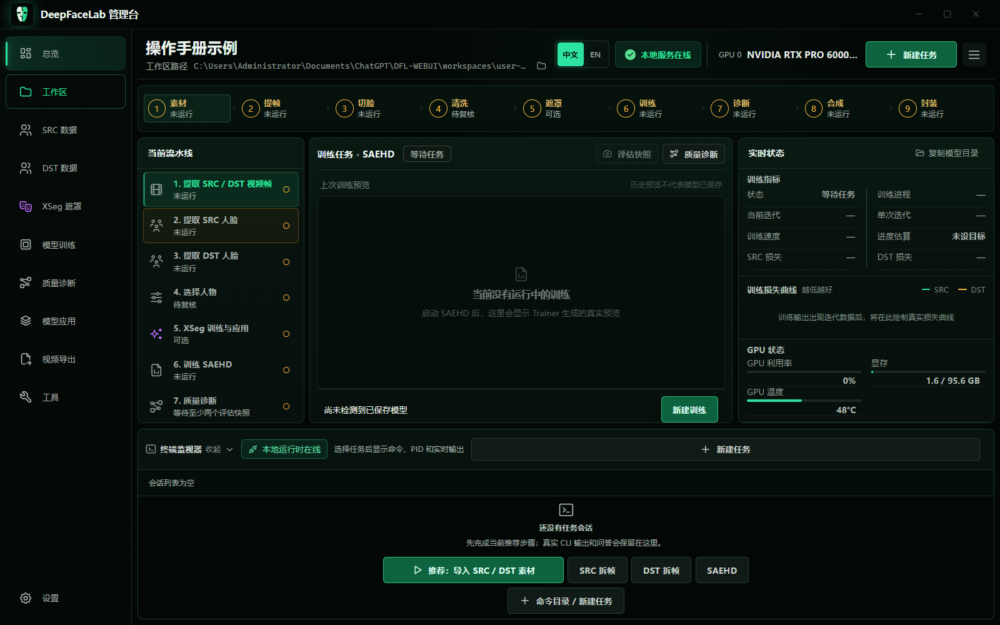

| 区域 / Area | 如何使用 / How to use it |
| --- | --- |
| 左侧导航 / Sidebar | 进入工作区、SRC、DST、XSeg、训练、诊断、合成、导出、工具或设置。 / Open Workspace, SRC, DST, XSeg, Training, Diagnostics, Merge, Export, Tools, or Settings. |
| 顶部项目栏 / Project header | 核对当前项目，切换语言，查看服务/GPU 状态，打开“新建任务”。 / Check the active project, change language, inspect service/GPU status, and open New task. |
| 项目流程 / Workflow bar | 按 **素材 → 提帧 → 切脸 → 清洗 → 遮罩 → 训练 → 诊断 → 合成 → 封装** 导航。每个步骤都可点击。 / Navigate through **Materials → Frames → Faces → Clean → Masks → Train → Diagnostics → Merge → Encode**. Every step is clickable. |
| 中部内容 / Main area | 查看当前功能、素材、预览和操作按钮。 / Work with the selected feature, material, preview, and controls. |
| 底部终端监视器 / Terminal monitor | 展开查看任务会话、真实输出和待回答的问题；收起后仍能查看状态。 / Expand to inspect task sessions, real output, and prompts; collapse to keep a compact status bar. |
| 后台操作卡 / Background operation card | 长时间分析、导入等操作会显示进度；可用时提供取消或检查状态。 / Long analyses and imports show progress, with cancellation or status checks when available. |

**状态含义 / Status:** “进行中”表示任务仍在运行；“成果可用”表示检测到已有产物，不等于当前正在处理，也不等于质量通过验收。“清洗：待复核”需要人工判断。“遮罩：可选”不会单独阻止后续流程。

**进行中 / Running** means work is running. **成果可用 / Output available** means saved outputs exist; it does not imply current processing or accepted quality. **清洗：待复核 / Cleaning: review required** needs human judgment. **遮罩：可选 / Masks: optional** does not by itself block the following stages.

## 2. 创建和切换项目 / Create and switch projects

1. 点击左下角 **设置 / Settings**，找到 **受管项目工作区 / Managed project workspaces**。
2. 填写 **项目名称 / Project name** 和 **项目标识 / Project ID**。名称用于显示；标识用于项目目录，例如 `user-interface-guide`。
3. 检查界面预览的 `workspaces/user-interface-guide`，点击 **创建受管项目 / Create managed project**。创建成功后，当前项目仍保持原样。
4. 在新项目一行点击 **切换 / Switch**，核对目标，点击 **确认切换 / Confirm switch**。
5. 等待切换对话框关闭、顶部项目名和路径变为目标项目，并重新显示服务在线。

1. Open **设置 / Settings** and find **受管项目工作区 / Managed project workspaces**.
2. Enter a **项目名称 / Project name** and **项目标识 / Project ID**. The name is displayed in the UI; the ID forms the directory, such as `user-interface-guide`.
3. Check the previewed `workspaces/user-interface-guide` path and select **创建受管项目 / Create managed project**. Creating a project does not activate it.
4. Select **切换 / Switch** on the new project's row, check the destination, and choose **确认切换 / Confirm switch**.
5. Wait for the dialog to close, the header and path to show the destination project, and the service to return online.

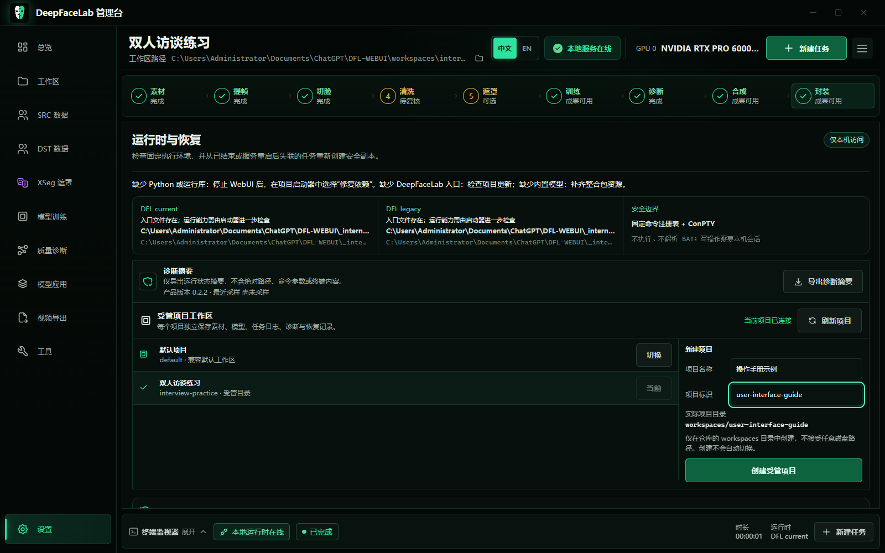

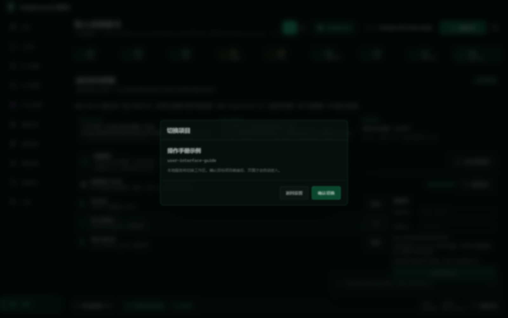

**完成检查 / Check:** 顶部名称与目录必须同时对应新项目。每个项目独立保存素材、模型、任务和恢复记录。存在活动任务时不能切换；先正常结束任务。若提示切换结果未确认，使用 **检查切换状态 / Check switch status**，等到确认就绪。

The header name and directory must both identify the new project. Material, models, tasks, and recovery records are project-specific. Finish active tasks before switching. If the switch result is uncertain, use **检查切换状态 / Check switch status** until readiness is confirmed.

## 3. 导入 SRC 与 DST / Import SRC and DST

| 名称 / Name | 作用 / Purpose |
| --- | --- |
| **SRC 源视频 / SRC source video** | 提供换入的人脸身份。优先选择清楚、角度和表情丰富的素材。 / Supplies the identity to transfer. Prefer clear material with varied angles and expressions. |
| **DST 目标视频 / DST target video** | 提供最终视频的动作、身体、场景和声音；选择要被替换的目标人物。 / Supplies the final motion, body, scene, and sound. Select the person to replace. |

1. 点击 **工作区 / Workspace**，在 SRC 卡片点击 **导入 / Import**，选择本地视频。
2. 在确认框核对侧别、文件名和大小，点击 **确认操作 / Confirm action**，等待“已导入”。
3. 对 DST 重复操作。
4. 核对两侧视频缩略图、时长、分辨率和文件大小。界面将视频保存为当前项目中的固定 `data_src.*`、`data_dst.*` 名称。

1. Open **工作区 / Workspace**, select **导入 / Import** on the SRC card, and choose a local video.
2. Verify the side, filename, and size in the dialog; select **确认操作 / Confirm action** and wait for the imported state.
3. Repeat for DST.
4. Check both thumbnails, durations, resolutions, and file sizes. The UI saves them under the current project as `data_src.*` and `data_dst.*`.

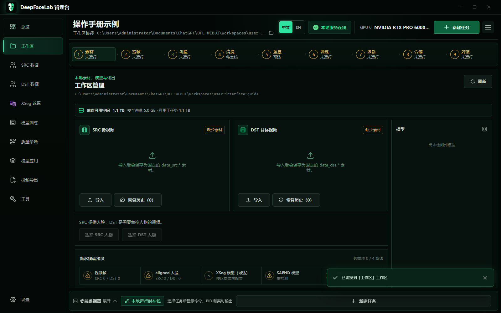

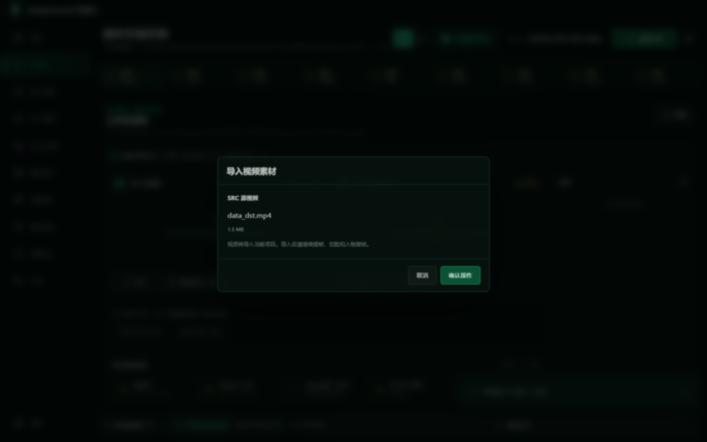

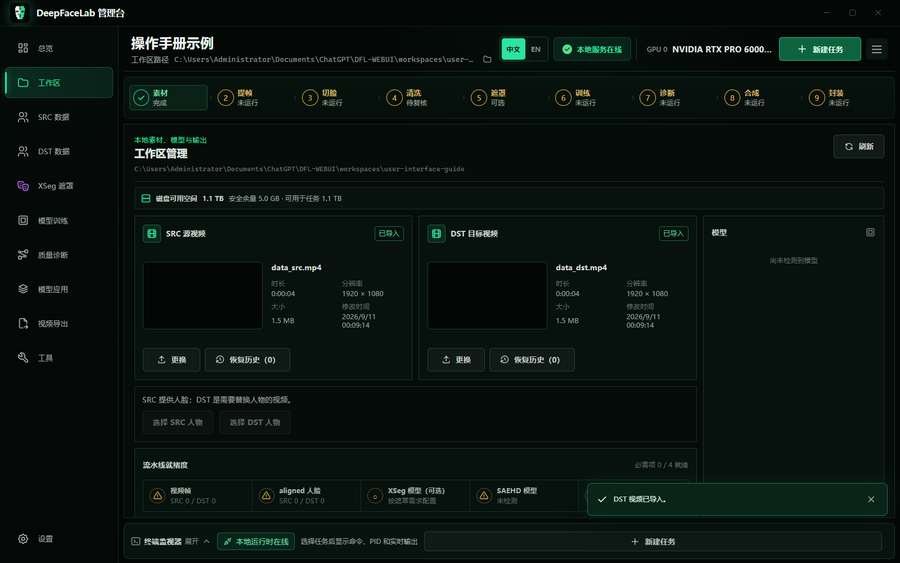

**更换与恢复 / Replacement and recovery:** 已导入时按钮变为 **更换 / Replace**。旧视频进入该侧 **恢复历史 / Recovery history**。更换或恢复视频不会自动重新生成帧、人脸、模型或成片；确认素材后重新执行受影响的步骤。任务运行期间不能更换或恢复视频。

After import, the button becomes **更换 / Replace**. The previous video enters that side's **恢复历史 / Recovery history**. Replacing or restoring a video does not regenerate frames, faces, models, or results. Rerun the affected stages after confirming the material. Video replacement and restoration are unavailable while a task is active.

## 4. 任务向导与提帧 / Task wizard and frame extraction

大部分处理任务都使用同一个三步向导。顶部 **新建任务 / New task** 可打开完整任务目录；页面内的快捷按钮会预选对应任务。

Most processing tasks use the same three-step wizard. **新建任务 / New task** opens the full catalog; shortcuts within a page preselect the relevant task.

### 4.1 选择任务 / Choose the task

点击 **新建任务**，在 **搜索任务 / Search tasks** 中搜索，或在 **任务类型 / Task type** 中选择 **提取 SRC 视频帧 / Extract SRC video frames**。核对右侧执行摘要的当前工作区和保存位置，点击 **下一步 / Next**。

Select **新建任务 / New task**, search the catalog or use **任务类型 / Task type**, and choose **提取 SRC 视频帧 / Extract SRC video frames**. Check the workspace and output directory in the execution summary, then select **下一步 / Next**.

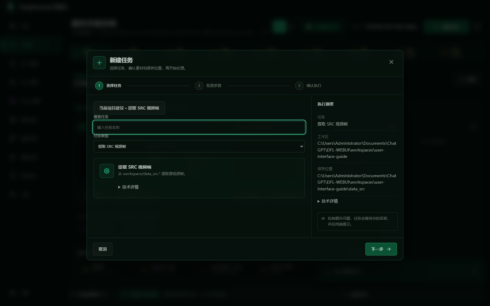

### 4.2 配置提帧 / Configure extraction

| 参数 / Parameter | 操作说明 / Guidance |
| --- | --- |
| 帧图片格式 / Frame image format | PNG 为无损帧；JPG 更节省空间。本文选择 PNG。 / PNG preserves lossless frames; JPG saves disk space. This example uses PNG. |
| 每秒提取帧数 / Frames per second | `0` 表示保留原视频完整帧率。SRC 可按素材长度抽帧；DST 要保留最终视频时间线时使用 `0`。本文两侧均为 `0`。 / `0` keeps the original full frame rate. SRC can be sampled for longer material; use `0` for DST when preserving the final timeline. Both sides use `0` here. |

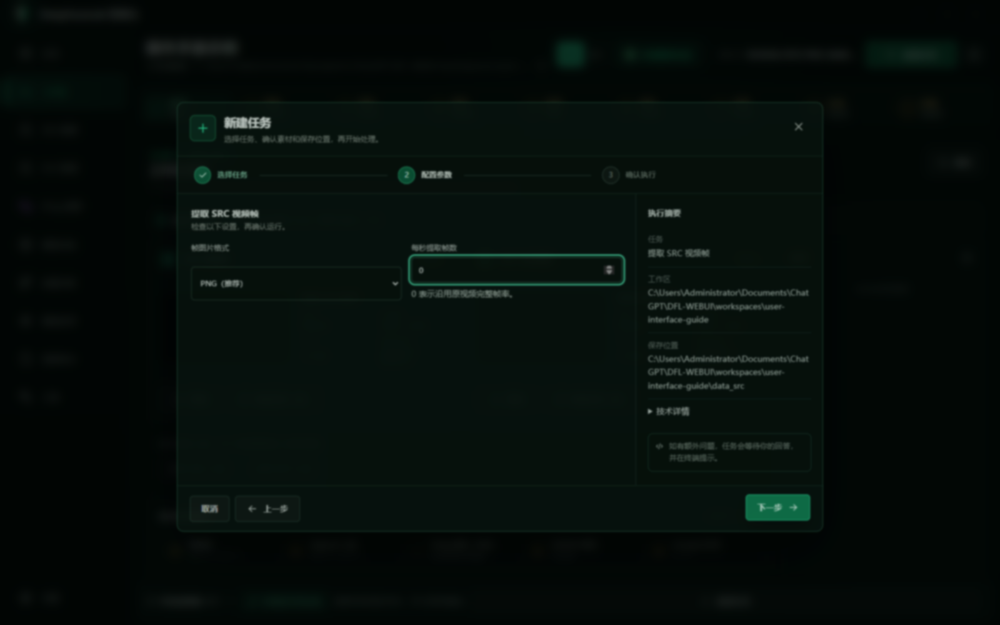

### 4.3 确认执行与等待 / Confirm and wait

1. 点击 **下一步**，等待 **前置检查通过 / Preflight checks passed**。若检查失败，先按提示补齐素材或修复环境，再重新检查。
2. 核对任务、参数和保存位置，点击 **启动任务 / Start task**。
3. 展开底部 **终端监视器 / Terminal monitor**，选择任务标签，查看真实进度和退出结果。不要因为输出暂时静止就重复提交任务。
4. SRC 完成后，同样运行 **提取 DST 视频帧 / Extract DST video frames**。

1. Select **下一步 / Next** and wait for **前置检查通过 / Preflight checks passed**. Resolve missing material or runtime problems before retrying a failed check.
2. Verify the task, parameters, and output directory, then select **启动任务 / Start task**.
3. Expand **终端监视器 / Terminal monitor**, select the task tab, and follow actual output and the final state. Do not submit a duplicate task merely because output pauses.
4. When SRC finishes, run **提取 DST 视频帧 / Extract DST video frames** in the same way.

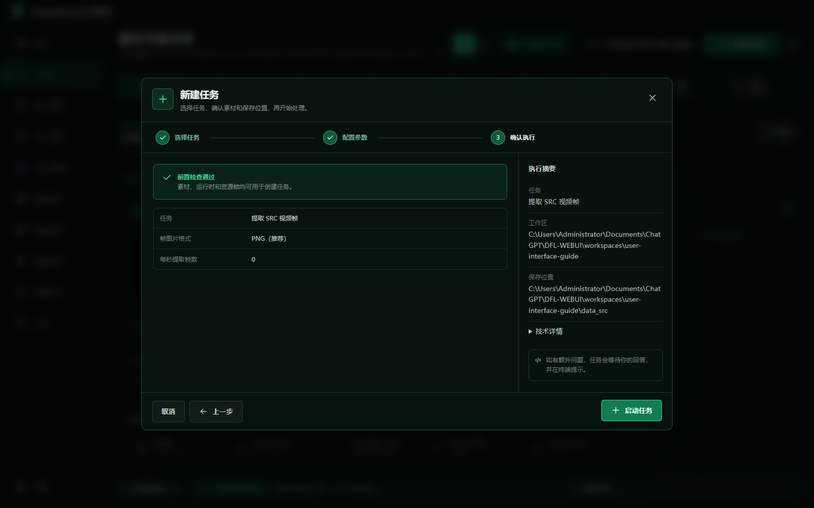

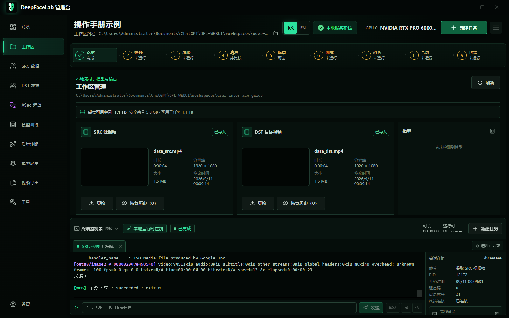

**完成检查 / Check:** 任务为“已完成”，工作区视频帧计数增加。本文 4 秒 × 25 fps，两侧各 100 帧。提帧只生成原始画面；还需要下一步切脸。

The task should finish successfully and frame counts should increase in Workspace. This example produces 100 frames per side: four seconds × 25 fps. Frame extraction creates full video frames; face extraction follows next.

## 5. 提取和检查人脸 / Extract and inspect faces

1. 点击 **SRC 数据 / SRC Data** → **SRC 人脸 / SRC faces**，或从任务目录选择 **提取 SRC 人脸 / Extract SRC faces**。
2. 配置下表参数，完成前置检查后启动。多人镜头请给“每帧最大人脸数”留出余量，再在清洗阶段选择目标人物。
3. 任务结束后点击 SRC 数据页的 **刷新 / Refresh**，查看 aligned 人脸。
4. 对 DST 重复 **提取 DST 人脸 / Extract DST faces**。

1. Open **SRC 数据 / SRC Data** → **SRC 人脸 / SRC faces**, or select **提取 SRC 人脸 / Extract SRC faces** from the catalog.
2. Configure the parameters below and start after preflight. Allow enough faces per frame for multi-person footage, then select the intended identity during cleaning.
3. When the task finishes, select **刷新 / Refresh** on SRC data to inspect aligned faces.
4. Repeat with **提取 DST 人脸 / Extract DST faces**.

| 参数 / Parameter | 说明及本文设置 / Meaning and example |
| --- | --- |
| 运行设备 / Processing device | 选择实际可用 GPU，或 CPU。本文使用 CPU 验证兼容流程，速度不能代表 GPU 性能。 / Choose a supported GPU or CPU. This recording uses CPU; its speed is not a GPU benchmark. |
| 检测器 / Detector | 本文使用 S3FD。手动检测涉及额外人工交互，不属于这条自动提取路径。 / This example uses S3FD. Manual detection requires additional interaction outside this automatic extraction path. |
| 人脸类型 / Face type | 本文使用 `whole_face`；应与后续模型的覆盖范围相符。 / This example uses `whole_face`; match the coverage required by the subsequent model. |
| 人脸图片尺寸 / Face image size | 本文使用 512 px。较大的 aligned 图不会自动提升低分辨率模型的输出质量。 / This example uses 512 px. Larger aligned images do not automatically improve a low-resolution model's output. |
| 每帧最大人脸数 / Maximum faces per frame | 本文设为 `5`，保留采访双方和海报等候选，再复核。 / Set to `5` here to retain both interview participants and poster candidates for review. |
| 显示高级参数 / Show advanced parameters | 展开查看 JPEG 质量等可选参数；常规操作可以保持默认。 / Expand for options such as JPEG quality; defaults are sufficient for this walkthrough. |

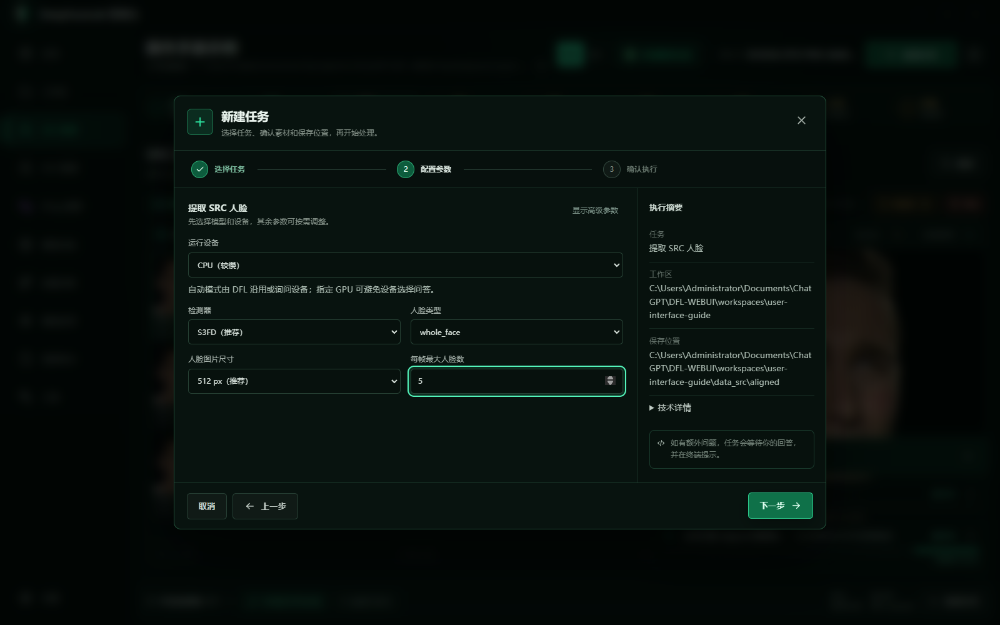

### 5.1 回答终端问题 / Answer terminal questions

任务可能在启动后显示 **等待输入 / Waiting for input**。展开终端，先阅读完整问题，再使用 **CLI 输入 / CLI input** 与 **发送 / Send**，或点击 **默认 / Default**、**是 / Yes**、**否 / No**。这些快捷回答针对当前问题，不是通用的继续按钮。

A task may show **等待输入 / Waiting for input** after starting. Expand the terminal, read the full question, and use **CLI 输入 / CLI input** with **发送 / Send**, or select **默认 / Default**, **是 / Yes**, or **否 / No**. These buttons answer the current question; they are not universal continue buttons.

本文的“将调试图像写入 aligned_debug?”选择 **否**。如需额外调试图，可按实际需要选择“是”。方括号中的 `[n]` 是当前默认值。

For “Write debug images to aligned_debug?”, this recording selects **否 / No**. Select Yes if you need those additional debug images. The value in brackets, `[n]`, is the default.

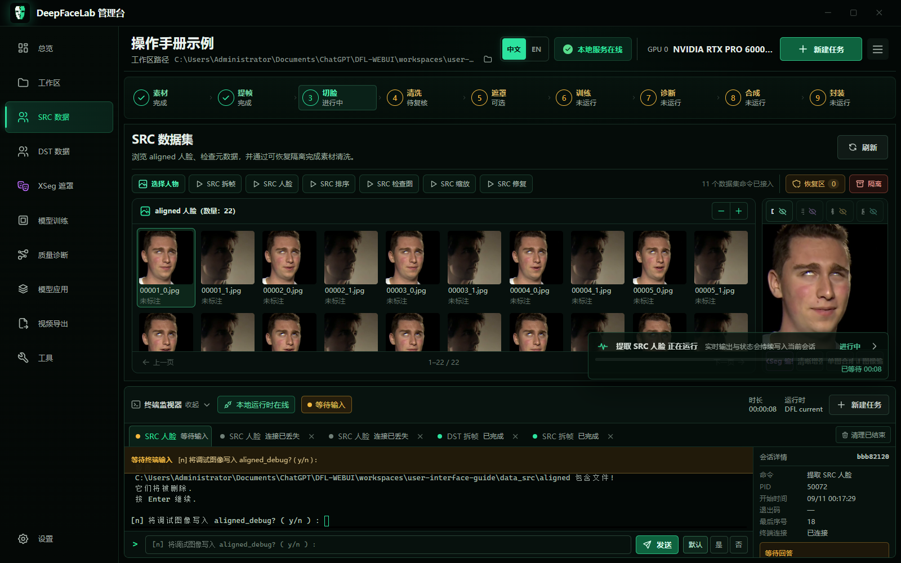

**重复提取 / Re-extraction:** 已有 aligned 文件时，底层可能提示它们将被删除并要求按 Enter。先确认这是打算重做的数据集；需要保留时先备份，再继续。点击“默认”在这个问题中等同于按 Enter。

If aligned files already exist, the underlying tool may warn that they will be deleted and ask for Enter. Confirm that you intend to regenerate this dataset, and back up anything you need before proceeding. For this specific question, Default sends Enter.

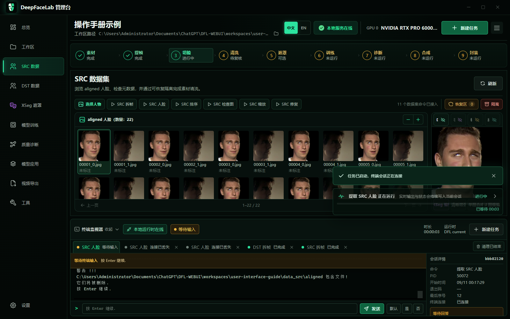

### 5.2 检查 aligned 人脸 / Inspect aligned faces

点击左侧网格中的缩略图，在右侧检查人脸方向、裁切、关键点和来源。顶部图层按钮用于显示或隐藏相应信息；右侧底部可进入遮罩编辑或图像工具。网格的 `− / +` 调整缩略图密度，**上一页 / Previous** 和 **下一页 / Next** 切换素材页。

Select a thumbnail in the grid and inspect orientation, crop, landmarks, and source information on the right. Layer controls toggle the corresponding overlays; actions below the preview open mask editing or image tools. Use `− / +` to change thumbnail density and the previous/next controls to move between pages.

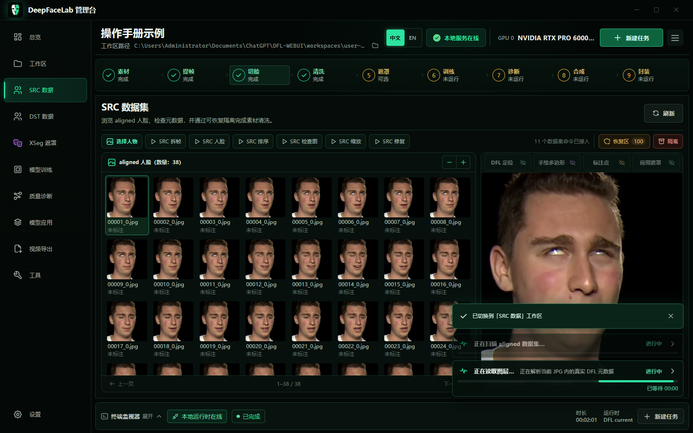

**完成检查 / Check:** 任务已完成、网格可加载人脸、图层信息可读取。多人镜头、海报和背景脸也可能被提取；不要直接把全部候选用于训练。本文两侧各提取 138 张候选人脸。

Confirm that the task is complete, the grid loads faces, and layer information is readable. Multiple participants, posters, and background faces may all be extracted. Review the candidates before training. This example extracts 138 candidate faces per side.

## 6. 人物复核、清洗和恢复 / Person review, cleaning, and recovery

### 6.1 先选择正确人物 / Select the intended person first

入口任选其一：**SRC 数据或 DST 数据 → 选择人物**、**工作区 → 选择 SRC 人物 / 选择 DST 人物**，或 **工具 → 数据审计 → 按角色分组**。

Open person review from **SRC data / DST data → Select person**, **Workspace → Select SRC person / Select DST person**, or **Tools → Data audit → Group by person**.

1. 核对正在分析的 SRC / DST 侧别，点击 **分析角色 / Analyze people**。
2. 等待候选组出现。默认严格度为 `0.50`；向右更严格，向左更宽松。分组只帮助归拢候选，仍需检查每组图片。
3. 对属于目标人物的组点击 **选择整组 / Select whole group**。同一人物可能分在多组，可以选择多个组；点击单张图片可以取消或重新选择。
4. 填写 **角色名称 / Person name**，选择 **分配用途 / Assign to**：源人物 SRC 或目标人物 DST。
5. 核对保留数、隔离数和去向，点击 **复核并分配 / Review and assign**。在确认框再次核对，点击 **确认分配 / Confirm assignment**。
6. 查看分配结果，再进入另一侧重复操作。

1. Check the SRC / DST side and select **分析角色 / Analyze people**.
2. Wait for candidate groups. The default strictness is `0.50`; moving right is stricter and moving left is looser. Grouping is a review aid, so inspect the images in each group.
3. Choose **选择整组 / Select whole group** for the intended person. One person may occupy several groups; select all relevant groups and toggle individual images to exclude mistakes.
4. Enter a **角色名称 / Person name** and choose **分配用途 / Assign to**: source person SRC or destination person DST.
5. Check the retained count, quarantine count, and destination. Select **复核并分配 / Review and assign**, review the confirmation, then **确认分配 / Confirm assignment**.
6. Check the result and repeat for the other side.

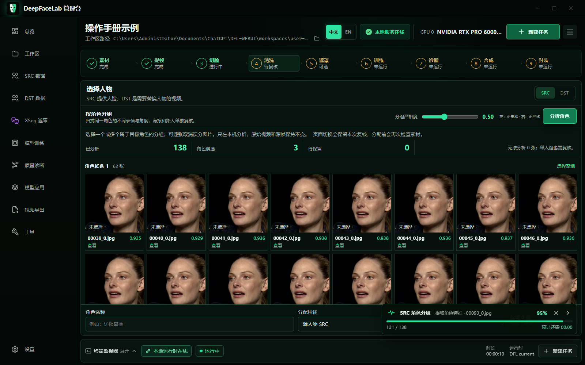

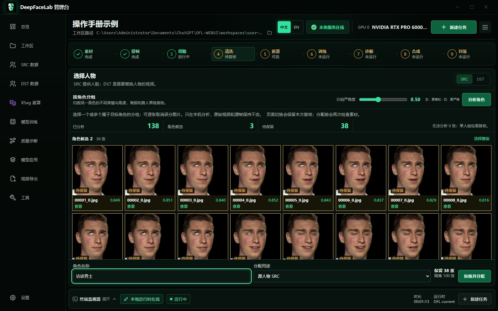

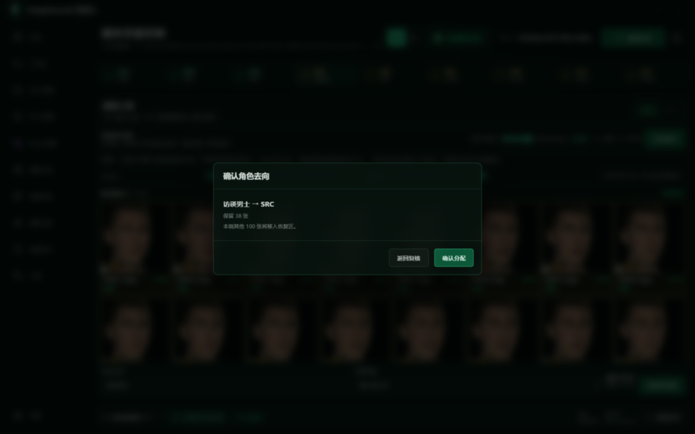

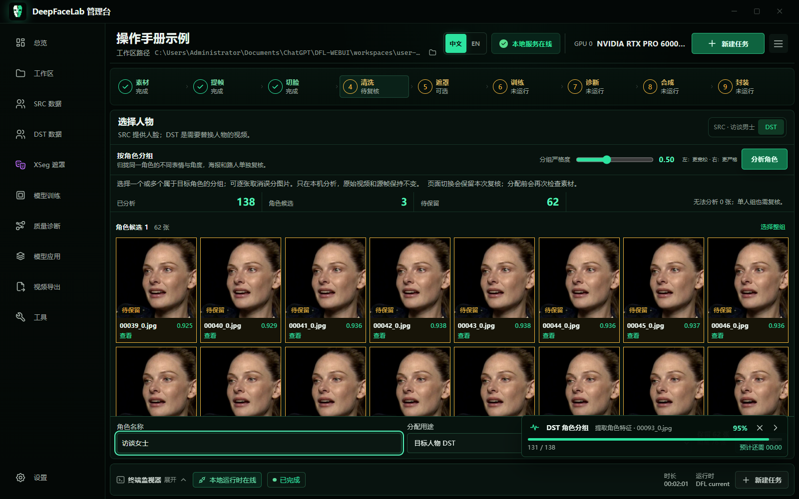

| 分配方式 / Assignment | 实际行为 / What happens |
| --- | --- |
| 留在当前侧 / Same side | 保留所选人脸，其他候选进入恢复区；原视频和直接帧保留。 / Keeps selected faces and moves the other candidates into recovery; retains the original video and direct frames. |
| 分配到另一侧 / Opposite side | 复制所选人脸、原视频和源帧；先归档目标侧旧素材及受影响的成片，来源侧保持原样。 / Copies selected faces, the source video, and source frames; archives replaced destination material and affected results first, leaving the source side intact. |

本文最终保留 **SRC 男士 38 张、DST 女士 62 张**，分别隔离其他 100 张和 76 张。实际制作时，请以自己素材的复核结果为准，不要照抄数量或组号。

The example retains **38 SRC faces of the man and 62 DST faces of the woman**, quarantining 100 and 76 other candidates respectively. Use the review results for your own footage; group numbers and counts are not universal.

**复核状态 / Review state:** 在应用内切换页面会保留本次选择和名称；刷新整个浏览器会清除尚未提交的复核草稿。素材发生变化后，需要重新分析，不能直接沿用旧分组执行分配。

In-app navigation preserves the current selection and name. Reloading the browser clears an unsubmitted review draft. If the dataset changes, analyze it again before assigning from a previous grouping.

### 6.2 检查质量和角度覆盖 / Check quality and pose coverage

打开 **工具 → 数据审计 → 质量审计**，先核对当前 SRC / DST 和分析范围，再按问题、遮罩状态或文件名筛选。点击样本，在右侧查看清晰度、曝光、遮罩覆盖和姿态。低分是复核线索，应结合图片判断。

Open **Tools → Data audit → Quality audit**. Check the side and analysis range, then filter by issue, mask state, or filename. Select a sample to inspect sharpness, exposure, mask coverage, and pose. Low scores identify review candidates; judge them together with the images.

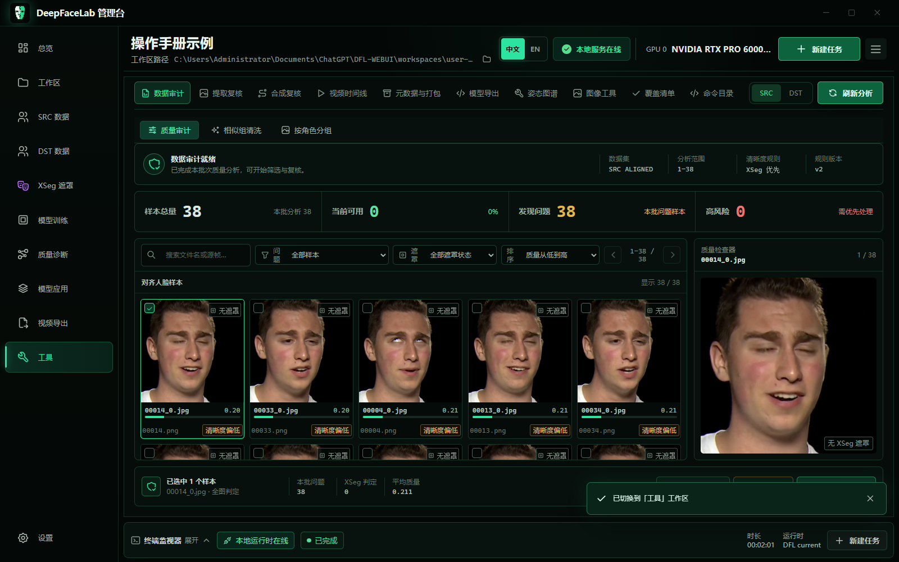

有效的已应用 XSeg 遮罩存在时，清晰度优先在遮罩内计算；否则按整张图计算。切换到 **姿态图谱 / Pose atlas** 的 **对比 / Compare**，点击姿态格子查看 SRC / DST 样本与占比。如果 DST 有明显角度而 SRC 缺少对应素材，应先补充 SRC。

With a valid applied XSeg mask, sharpness is measured primarily inside the mask; otherwise it uses the full image. Open **姿态图谱 / Pose atlas → 对比 / Compare**, then select a pose bin to inspect both datasets and their shares. Add SRC coverage when important DST angles lack corresponding source examples.

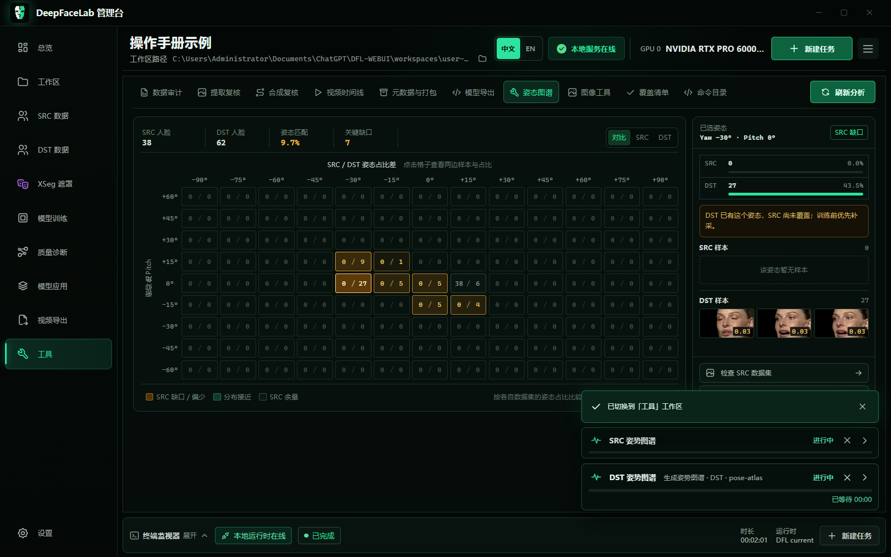

**相似组清洗 / Similarity cleaning:** 这是重复或近似画面的候选分析，与“按角色分组”用途不同。先复核代表图和其余候选，再选择重复项移入隔离区；不要仅凭外观相似就认定为同一个人物。

Similarity cleaning finds duplicate or visually similar image candidates and serves a different purpose from person grouping. Review the representative and other candidates before quarantining duplicates; visual similarity alone does not establish identity.

### 6.3 隔离与恢复 / Quarantine and restore

在 SRC / DST 数据页选中不需要的人脸，点击 **隔离 / Quarantine** 并核对确认。恢复时打开 **恢复区 / Recovery area**，选中对应文件，再点击 **恢复 / Restore**。检查 aligned 总数和缩略图是否恢复。操作针对当前侧的人脸文件。

Select an unwanted face on SRC / DST data, choose **隔离 / Quarantine**, and review the confirmation. To restore it, open **恢复区 / Recovery area**, select the relevant file, and choose **恢复 / Restore**. Verify the aligned count and thumbnail afterward. These actions apply to face files on the selected side.

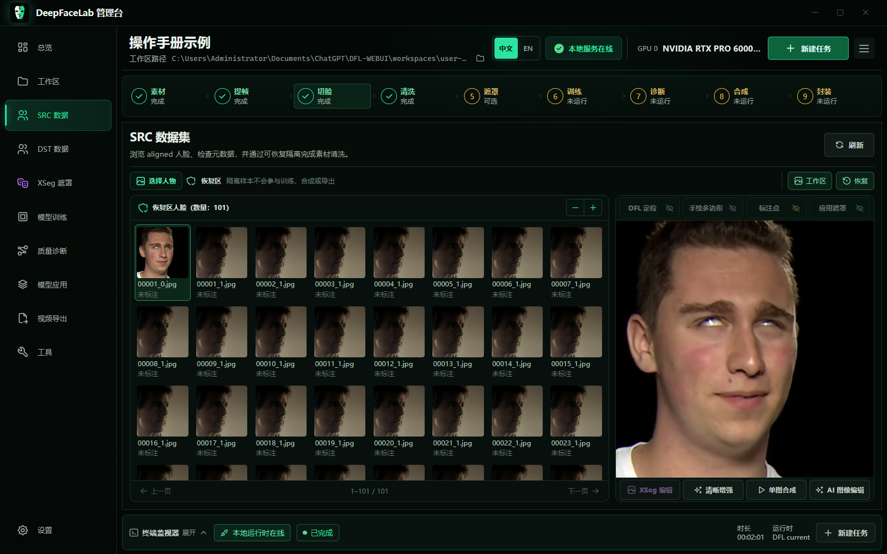

**完成检查 / Check:** 两侧只包含各自希望使用的人物；重要角度和表情有覆盖；误隔离可恢复。人物分配后的恢复入口可能是结果条的 **打开恢复区** 或 **恢复此次分配**，以实际记录类型为准。

Each side should contain the intended person, with useful angle and expression coverage, and accidental quarantines should be recoverable. After assignment, the result may offer **Open recovery** or **Restore this assignment**, depending on the type of recovery record.

## 7. XSeg 遮罩，可选 / XSeg masks, optional

XSeg 用于精细控制脸部边界与遮挡。**手绘多边形、XSeg 模型、已应用遮罩是三个不同阶段**：画完并保存多边形，不等于已经训练或应用 XSeg 模型。本文演示真实多边形编辑与保存；后续 SAEHD 合成使用模型学习的遮罩，未训练或应用独立 XSeg 模型。

XSeg provides finer control over face boundaries and occlusions. **Hand-drawn polygons, an XSeg model, and applied masks are three different stages**: saving polygons does not train or apply a model. This recording demonstrates actual polygon editing and saving; subsequent SAEHD merging uses learned masks, without training or applying a separate XSeg model.

### 7.1 绘制并保存多边形 / Draw and save polygons

1. 打开 **XSeg 遮罩 / XSeg Masks**，核对顶部的 SRC / DST，点击要标注的图片。也可以从人脸检查器的 **XSeg 编辑 / Edit XSeg** 进入同一张图。
2. 选择 **保留区 / Include**，沿希望保留的脸部轮廓逐点点击，至少 3 个点后点击 **闭合 / Close**。
3. 有遮挡或需要排除的区域时，选择 **排除区 / Exclude**，再绘制并闭合一个多边形。排除区会从保留区中扣除。
4. 拖动顶点修正边界，检查下方是否仍有未闭合点。点击 **写入 JPG / Write to JPG**，等待保存完成。
5. 点击 **刷新 / Refresh** 或重新选择该图，确认轮廓能够读回、缩略图显示标注数量。

1. Open **XSeg 遮罩 / XSeg Masks**, check SRC / DST, and select a face. You can also use **XSeg 编辑 / Edit XSeg** from the face inspector to open that image.
2. Choose **保留区 / Include**, click points around the face boundary you want to retain, then select **闭合 / Close** after at least three points.
3. For an occluder or unwanted region, choose **排除区 / Exclude**, draw another polygon, and close it. Excluded regions are subtracted from included regions.
4. Drag vertices to refine the boundary. Finish any open polygon, select **写入 JPG / Write to JPG**, and wait for completion.
5. Refresh or reselect the image to confirm that the polygon reloads and the thumbnail shows the annotation count.

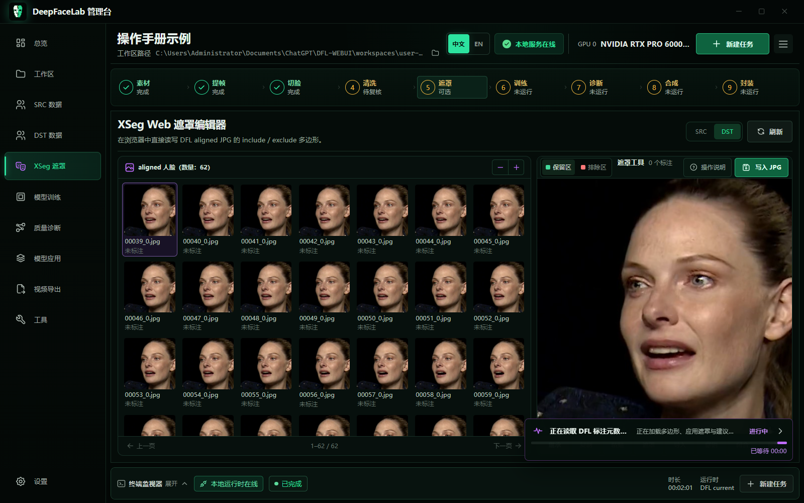

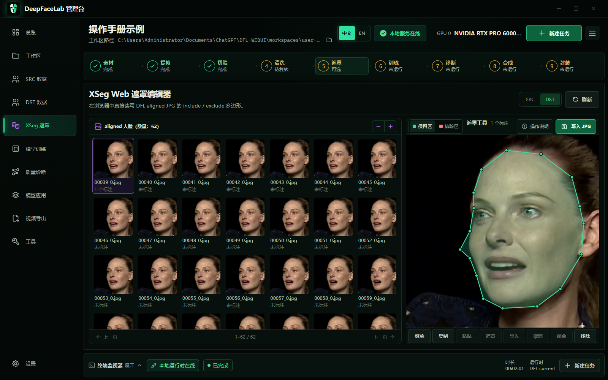

### 7.2 编辑快捷键 / Editing shortcuts

| 按钮或按键 / Control | 用途 / Action |
| --- | --- |
| `Q` / `W` | 切换保留区 / 排除区。 / Select Include / Exclude. |
| 闭合 / Close | 完成当前多边形；至少需要 3 个点。 / Finish the current polygon; requires at least three points. |
| 撤销 / Undo | 撤回当前尚未闭合轮廓的最后一个点。 / Remove the last point of the open polygon. |
| 移除 / Remove | 移除最后一个已闭合多边形。 / Remove the last closed polygon. |
| `Tab` + 方向键 / Arrow keys | 选中顶点后每次移动 1 像素；加 `Shift` 为 5 像素。 / Focus a vertex, then move by one pixel, or five with Shift. |
| `Delete` | 删除选中顶点；不足 3 点的多边形会被移除。 / Delete the selected vertex; a polygon with fewer than three points is removed. |
| `Ctrl+S` | 保存到当前 JPG。 / Save to the current JPG. |
| `Ctrl+C` / `Ctrl+V` | 在编辑器内复制 / 粘贴轮廓，粘贴后仍需检查和保存。 / Copy / paste polygons within the editor; review and save after pasting. |
| 继承 / Inherit | 读取上一张图片的标注，作为当前图的起点；上一张需已有标注。 / Use the previous image's annotations as a starting point; it must already have polygons. |
| `←` / `→` | 焦点不在输入框或顶点上时，切换前后图片。 / Navigate between images when focus is outside an input or vertex. |
| 遮罩 / Masks | 显示或隐藏已经应用的遮罩；没有应用遮罩时不可用。 / Toggle an existing applied mask; unavailable when no mask exists. |
| 导入 / Import、`G` | 从已经应用的遮罩导入建议轮廓；这不是一次新预测。 / Import suggested contours from an existing applied mask; this does not run a new prediction. |

离开有未保存修改的图片时，先保存，或在提示中明确选择放弃。示例轮廓用于演示编辑步骤；训练 XSeg 时应对两侧有代表性的角度、表情和遮挡进行细致标注。

Save before leaving an edited image, or explicitly discard the changes when prompted. The example polygon demonstrates editing mechanics. For XSeg training, carefully annotate representative angles, expressions, and occlusions from both sides.

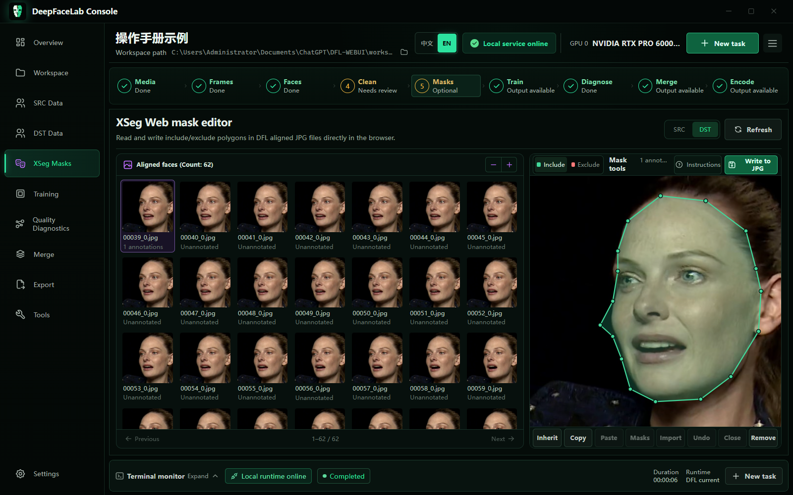

### 7.3 需要独立 XSeg 模型时 / When using a separate XSeg model

1. 完成所需标注后，打开 **新建任务 → 训练 XSeg / Train XSeg**，选择新建或现有模型，设置名称和设备。
2. 通过前置检查后启动，并回答底部终端中的首次配置问题。缺少有效手绘标签时，先回编辑器补齐。
3. 按训练质量保存并停止，然后分别运行 **应用 XSeg 到 SRC / Apply XSeg to SRC** 和 **应用 XSeg 到 DST / Apply XSeg to DST**。
4. 回到数据集检查应用遮罩边缘和遮挡。使用内置模型时，选择相应的 **应用内置 XSeg 到 SRC / DST** 任务，并确保内置资源可用。

1. After labeling, open **New task → 训练 XSeg / Train XSeg**, choose a new or existing model, and set its name and device.
2. Start after preflight and answer initial configuration prompts in the terminal. Add valid hand-drawn labels first if preflight reports them missing.
3. Save and stop according to model quality, then run **应用 XSeg 到 SRC / Apply XSeg to SRC** and **应用 XSeg 到 DST / Apply XSeg to DST**.
4. Return to the datasets and inspect mask edges and occlusions. To use a bundled model, choose the corresponding **Apply bundled XSeg to SRC / DST** task and ensure its resources are available.

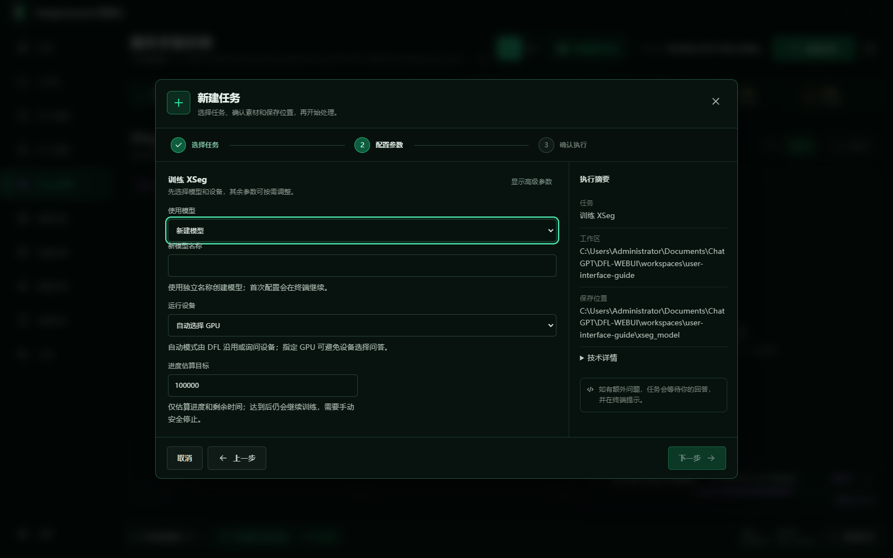

## 8. 创建模型与训练 / Create a model and train

### 8.1 新建 SAEHD 模型 / Create a SAEHD model

1. 完成 SRC / DST 人物复核后，打开 **模型训练 / Training**，点击 **新建训练 / New training**，或在新建任务中选择 **训练 SAEHD / Train SAEHD**。
2. **使用模型 / Model to use** 选择 **新建模型 / Create a model**，填写不与现有模型重复的名字。本文为 `guide-saehd-128`。
3. 选择运行设备，填写 **进度估算目标 / Progress estimate target**。本文使用 CPU 和 `300`。
4. 核对保存位置是当前项目的 `model` 目录，完成前置检查后启动。

1. Finish SRC / DST person review, open **模型训练 / Training**, and choose **新建训练 / New training**, or select **训练 SAEHD / Train SAEHD** from New task.
2. Set **使用模型 / Model to use** to **新建模型 / Create a model** and enter a unique name. This example uses `guide-saehd-128`.
3. Select the device and a **进度估算目标 / Progress estimate target**. This recording uses CPU and `300`.
4. Verify that the output is the current project's `model` directory, then start after preflight.

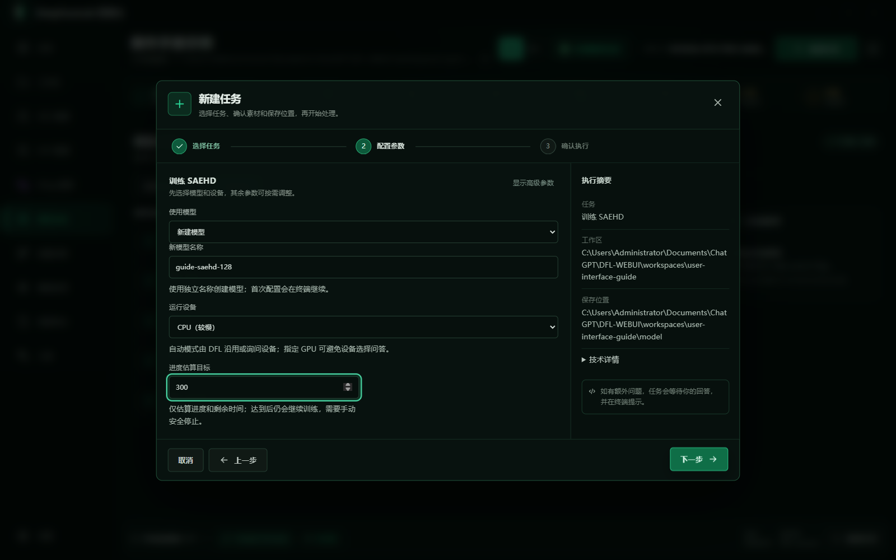

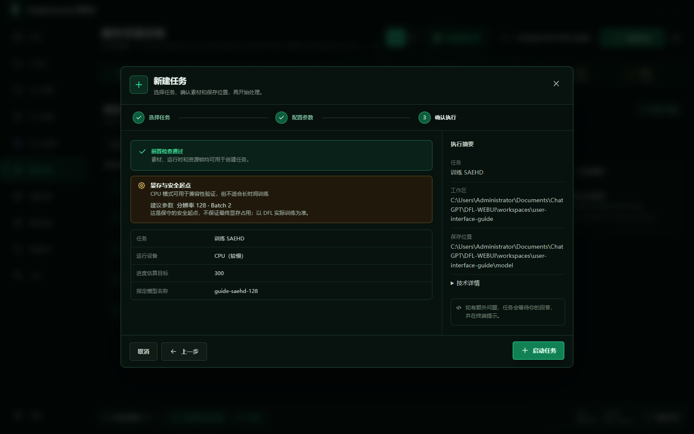

**两种“目标”要分清 / Distinguish the two targets:** Web 向导的“进度估算目标”只用于进度和剩余时间估算，达到后不会自动停止训练。底层首次配置还可能询问“目标迭代次数”，它属于模型自身的设置。本文将底层目标设为 `0`，然后通过 Web 安全停止按钮结束训练。

The wizard's progress estimate target only drives progress and remaining-time estimates; it does not automatically stop training. Initial terminal configuration may also ask for a target iteration count, which is a separate model setting. This recording sets that underlying target to `0` and stops training through the Web safe-stop control.

### 8.2 完成首次模型配置 / Complete initial model configuration

首次创建需要在底部终端逐项回答。每次先阅读问题，再填写 **CLI 输入** 并发送；空白发送或“默认”接受方括号中的默认值。不要一次粘贴一长串回答。

A new model asks additional questions in the terminal. Read each prompt, fill **CLI input**, and send it. An empty response or Default accepts the value in brackets. Do not paste a long sequence of answers at once.

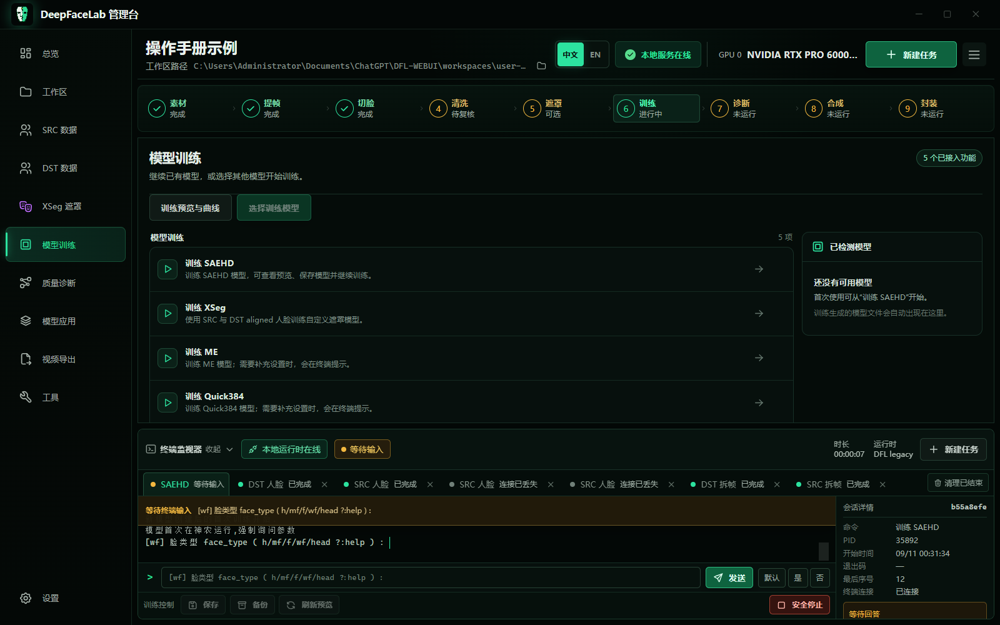

| 配置项 / Setting | 本文实际值 / Recorded value |
| --- | --- |
| 模型名称 / Model name | `guide-saehd-128` |
| 脸类型 / Face type | `wf` |
| 分辨率 / Resolution | `128` |
| AE 架构 / AE architecture | `df-d` |
| 自动编码器维度 / Autoencoder dimensions | `32` |
| 编码器 / 解码器维度 / Encoder / decoder dimensions | `16 / 16` |
| 遮罩解码器维度 / Mask decoder dimensions | `8` |
| 批量大小 / Batch size | `2` |
| 底层目标迭代 / Underlying target iterations | `0` |
| SRC / DST 随机翻转 / Random SRC / DST flip | `n / n` |
| 将模型和优化器放在 GPU / Models and optimizer on GPU | `n`，因为本次使用 CPU / because this run uses CPU |
| 其他首次选项 / Other initial options | 使用该次终端提示中的默认值 / Defaults displayed by the terminal in this run |

这些是用于验证的小模型参数，不是适用于所有素材的画质方案。训练开始后，应根据自己的素材、预览和硬件决定配置与训练时长。

These are small-model verification settings, not a universal quality configuration. Choose production settings and training duration according to your material, previews, and hardware.

### 8.3 阅读训练预览 / Read the training preview

进入 **总览 / Overview** 或 **模型训练 / Training**，等待首张真实预览。预览出现前的等待状态是正常的；可展开底部终端查看加载、模型初始化或待回答的问题。

Open **总览 / Overview** or **模型训练 / Training** and wait for the first real preview. A waiting state is normal before that image arrives. Expand the terminal to check loading, model initialization, or unanswered prompts.

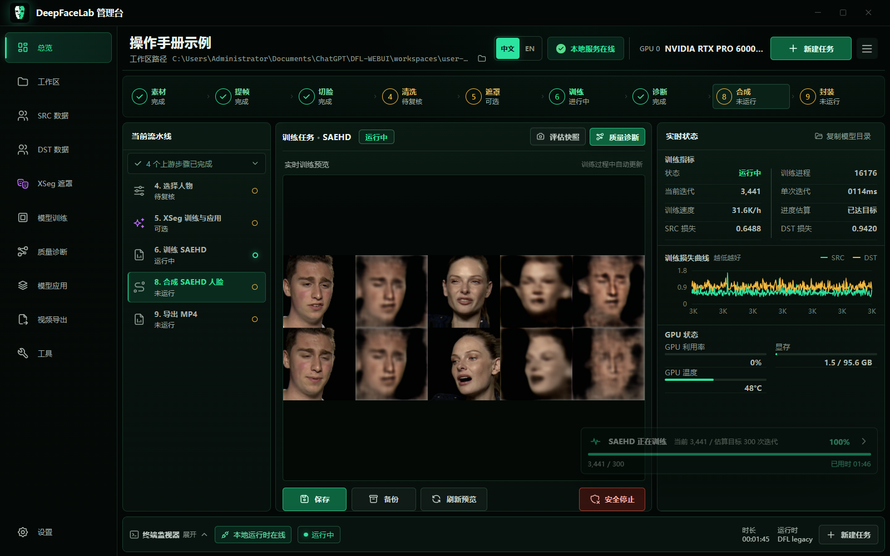

本文的 128px SAEHD 预览中，每行从左到右为 **SRC 输入 → SRC 重建 → DST 输入 → DST 重建 → DST 换脸结果**。其他模型或分辨率可能采用不同的排列。右侧损失曲线显示训练变化；低损失不保证身份、表情、边界和时间连续性已经合格。

In this 128px SAEHD preview, each row shows **SRC input → SRC reconstruction → DST input → DST reconstruction → DST swap**, from left to right. Other models or resolutions may arrange previews differently. The loss chart tracks training behavior; low loss alone does not guarantee acceptable identity, expression, edges, or temporal consistency.

**完成检查 / Check:** 迭代持续增加，预览能刷新，终端没有未处理的错误。示例为 CPU 训练，顶部 GPU 利用率较低并不代表训练停滞。

Iterations should increase, previews should refresh, and the terminal should have no unresolved errors. This run trains on CPU, so low GPU utilization does not mean it has stalled.

## 9. 保存、停止与续训 / Save, stop, and resume

| 操作 / Action | 结果 / Result |
| --- | --- |
| **保存 / Save** | 请求保存当前模型，训练继续。等待终端确认，不要只看点击反馈。 / Requests a model save while training continues. Wait for terminal confirmation, not just the click notification. |
| **备份 / Backup** | 请求 Trainer 创建模型备份；查看终端确认是否完成。 / Requests a model backup from Trainer; verify completion in the terminal. |
| **刷新预览 / Refresh preview** | 请求新的真实训练预览。 / Requests a fresh training preview. |
| **安全停止 / Safe stop** | 确认后请求保存并结束训练，等待最终状态。 / After confirmation, requests saving and ending training; wait for the final state. |

### 9.1 保存并停止 / Save and stop

1. 点击训练预览下方的 **安全停止 / Safe stop**，核对确认框。
2. 点击 **确认安全停止 / Confirm safe stop**，等待保存和进程退出。
3. 确认状态变为 **已安全停止 / Stopped safely**，页面保留训练预览、损失记录和模型名，并出现 **继续训练 / Continue training**。
4. 若出现强制停止、保存超时或连接丢失，按第 14 节核实；这些状态不能当作已确认保存。

1. Select **安全停止 / Safe stop** below the preview and review the dialog.
2. Select **确认安全停止 / Confirm safe stop**, then wait for saving and process exit.
3. Confirm **已安全停止 / Stopped safely**, with the preview, loss history, saved model name, and **继续训练 / Continue training** still available.
4. If the app reports a forced stop, save timeout, or lost connection, follow section 14. Those states do not verify a successful save.

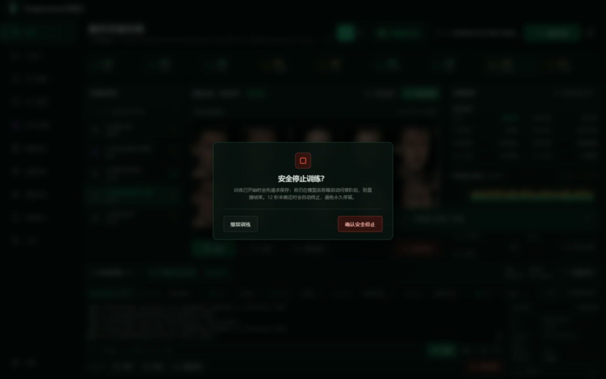

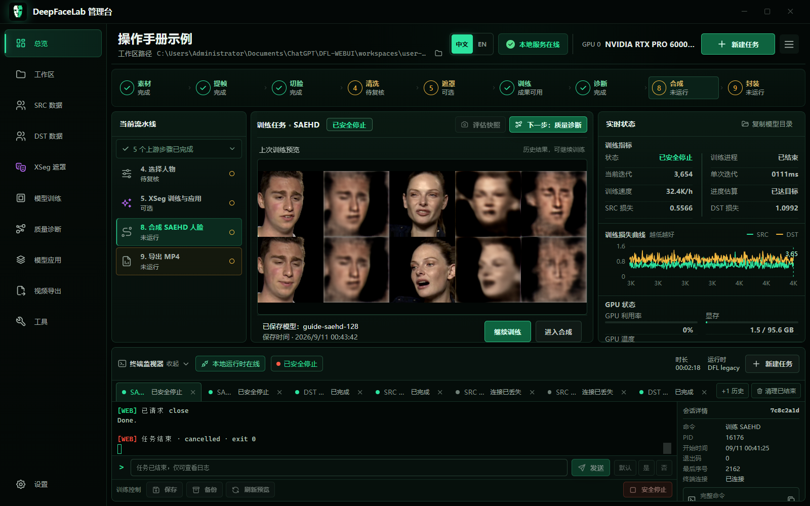

### 9.2 继续已有模型 / Resume a saved model

1. 点击 **继续训练 / Continue training**，进入任务向导。
2. 到“配置参数”页，确认 **使用模型** 是刚才保存的模型，设备和进度估算目标符合预期。
3. 完成前置检查并启动。已有模型结构和权重会保留；底层如出现限时修改参数提示，按需处理，不修改时等待继续。
4. 确认新会话的迭代接着旧模型增长，再观察新预览。本文首次停止于 `2,630` 次，续训后停止于 `3,654` 次。

1. Select **继续训练 / Continue training** to open the task wizard.
2. On Configure parameters, verify the saved model, device, and progress estimate target.
3. Start after preflight. Existing architecture and weights are retained. If the terminal offers a timed parameter-change prompt, use it only when needed; otherwise let startup continue.
4. Verify that the new session continues from the saved iteration and inspect the new preview. This recording first stopped at `2,630` iterations and stopped the resumed run at `3,654`.

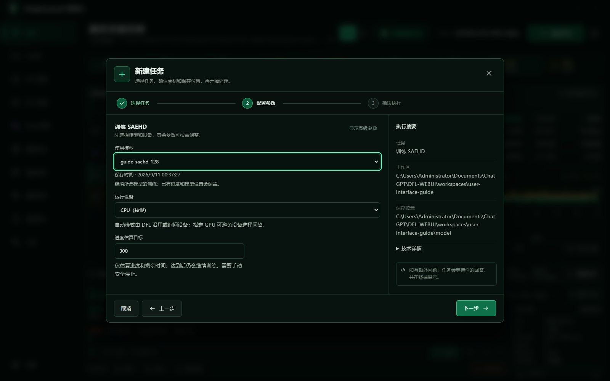

## 10. 质量诊断 / Quality diagnostics

质量诊断使用同一组固定评测样本比较训练快照。建议在训练运行时先生成一次快照，继续训练一段时间后再生成第二次；停止训练后仍可查看已保存快照。

Quality Diagnostics compares training snapshots using the same fixed evaluation samples. Generate one snapshot while training is running, train further, and generate another. Saved snapshots remain available after training stops.

1. 在训练页点击 **评估快照 / Evaluation snapshot**，或在诊断页点击 **生成评估快照 / Create evaluation snapshot**，等待完成。只有正在运行的受控 SAEHD 训练支持此操作。
2. 打开 **质量诊断 / Quality Diagnostics**，选择较早的 **基线 / Baseline** 和较新的 **当前 / Current** 快照。
3. 先看“比较前提”的四项：同一模型、同一评测样本清单、同一指标版本、同一模型结构。不能比较时，选择兼容组合。
4. 选择 **DST 重建 / DST reconstruction**、**SRC 重建 / SRC reconstruction** 或 **DST 换脸 / DST swap**，再选择要看的指标。
5. 点击有样本的姿势格，在下方比较同一输入、基线输出和当前输出。用前后箭头切换该格的样本。
6. 需要检查素材覆盖时，点击 **查看数据原因 / Inspect dataset cause** 进入姿势图谱。

1. Select **评估快照 / Evaluation snapshot** in Training, or **生成评估快照 / Create evaluation snapshot** in Diagnostics, and wait for completion. This requires a running, controlled SAEHD training job.
2. Open **质量诊断 / Quality Diagnostics**, then select an earlier Baseline and a newer Current snapshot.
3. Check all four comparison conditions: the same model, evaluation manifest, metric version, and architecture. Choose compatible snapshots if comparison is blocked.
4. Choose DST reconstruction, SRC reconstruction, or DST swap, then select the metric.
5. Click a populated pose cell and compare the same input, baseline output, and current output below. Use the arrows to browse samples in that cell.
6. Select **查看数据原因 / Inspect dataset cause** to investigate coverage in the pose atlas.

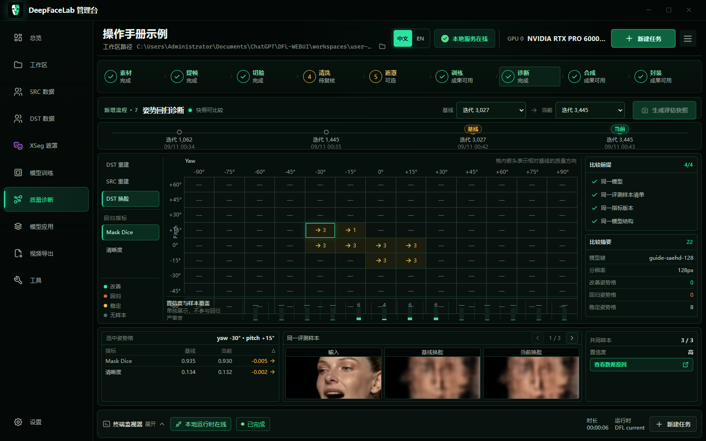

**如何判断 / Interpretation:** MSE 类误差通常越低越好，Mask Dice 越高表示遮罩重合度越高。清晰度应结合图像检查，不能单看数值。“无样本”表示缺少证据；样本少的格子只能提供趋势。诊断显示的是这组样本上的变化，最终仍要检查合成视频中的身份、遮挡和闪烁。

Lower MSE generally means less reconstruction error; higher Mask Dice means greater mask overlap. Judge sharpness alongside the images. Empty cells have no evidence, and sparsely populated cells provide only a trend. Diagnostics describes changes on this evaluation set; final acceptance still requires checking identity, occlusions, and flicker in the merged video.

## 11. 合成人脸 / Merge faces

开始前，先安全停止训练以释放模型资源，确认 DST 保留的是要替换的人物。本文使用 SAEHD 的学习遮罩，未训练独立 XSeg 模型。

Safely stop training to release model resources, and confirm that DST contains the person to replace. This example uses SAEHD's learned masks and does not train a separate XSeg model.

1. 打开 **模型应用 / Merge**，点击 **合成 SAEHD 人脸 / Merge SAEHD faces**。
2. 在配置页选择保存的模型和设备，设置合成模式、遮罩模式和工作线程。
3. 按需展开高级参数，设置遮罩侵蚀、羽化、颜色迁移等。先用小片段检查效果，再调整。
4. 核对输出为当前项目的 `data_dst/merged` 和 `data_dst/merged_mask`，通过前置检查后启动。
5. 展开终端查看处理进度和额外问题。等待 **已完成 / Completed**，再进入视频导出。

1. Open **模型应用 / Merge** and choose **合成 SAEHD 人脸 / Merge SAEHD faces**.
2. Select the saved model and device, then configure merge mode, mask mode, and worker count.
3. Expand advanced settings when needed for mask erosion, feathering, color transfer, and related controls. Check a short clip before refining them.
4. Verify the output folders `data_dst/merged` and `data_dst/merged_mask` in the active project, then start after preflight.
5. Expand the terminal to follow progress and answer extra prompts. Wait for **已完成 / Completed** before encoding.

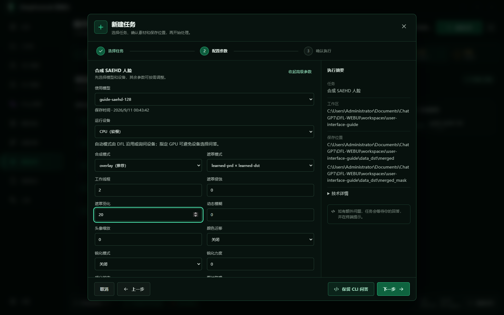

| 配置项 / Setting | 本文实际值 / Recorded value |
| --- | --- |
| 模型 / Model | `guide-saehd-128` |
| 运行设备 / Device | CPU |
| 合成模式 / Merge mode | `overlay` |
| 遮罩模式 / Mask mode | `4 · learned-prd × learned-dst` |
| 工作线程 / Workers | `2` |
| 遮罩羽化 / Mask blur | `20` |
| 其他高级参数 / Other advanced settings | 向导默认值 / Wizard defaults |

XSeg 遮罩模式需要对应可用的 XSeg 资源；前置检查提示资源缺失时，先完成相应准备，或根据实际流程选择可用的学习遮罩。不要只为消除提示而随意改变模式。重新合成会更新当前输出序列，重要的旧结果应先另存。

XSeg mask modes require their corresponding resources. If preflight reports missing resources, prepare them or choose an appropriate learned-mask mode for your workflow. Do not change modes merely to dismiss the message. A new merge updates the current output sequences; save important previous results separately first.

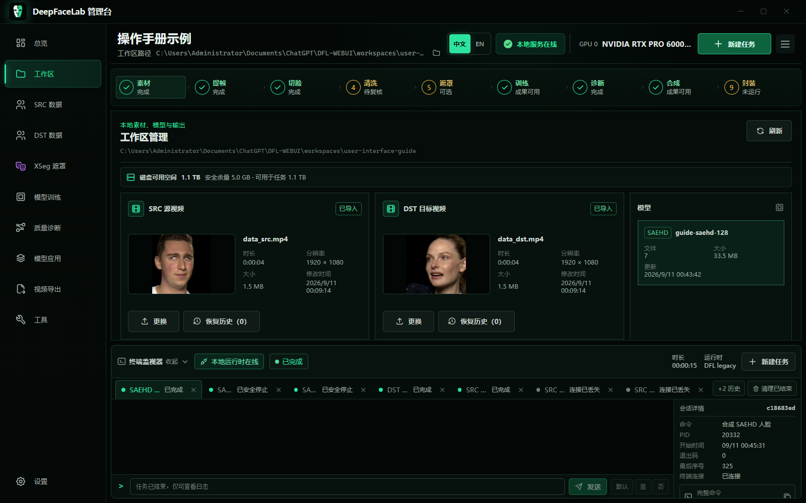

### 11.1 逐帧检查 / Inspect merged frames

打开 **工具 → 合成复核 / Tools → Merge review**，查看 DST 原帧、合成结果和合成遮罩三联图。检查“缺合成帧”和“缺遮罩”数量，再用前后箭头检查不同表情、转头和镜头切换。本文的三联序列完整度为 `100 / 100`。

Open **工具 → 合成复核 / Tools → Merge review** to compare the original DST frame, merged result, and mask. Check the missing-frame and missing-mask counts, then step through expressions, head turns, and shot changes. This recording has `100 / 100` complete triplets.

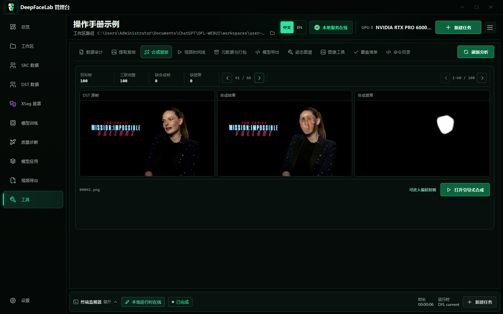

## 12. 导出和验收视频 / Export and check the video

### 12.1 导出 MP4 / Export MP4

1. 打开 **视频导出 / Export**，点击推荐区域的 **导出 MP4 / Export MP4**。
2. 设置 **视频码率 / Video bitrate**；本文为 `16 Mbps`。确认保存位置是当前项目下的 `result.mp4` 和 `result_mask.mp4`。
3. 完成前置检查并启动，等待任务 **已完成 / Completed**。正常 MP4 任务会依次生成成片和遮罩视频。
4. 页面出现两个成果文件后，在 **查看成果 / View output** 中选择要检查的视频。

1. Open **视频导出 / Export** and select the recommended **导出 MP4 / Export MP4** action.
2. Set **视频码率 / Video bitrate**, `16 Mbps` in this example. Confirm `result.mp4` and `result_mask.mp4` in the active project.
3. Start after preflight and wait for **已完成 / Completed**. The standard MP4 task produces the normal video and mask video in sequence.
4. Once both files appear, use **查看成果 / View output** to choose a video for inspection.

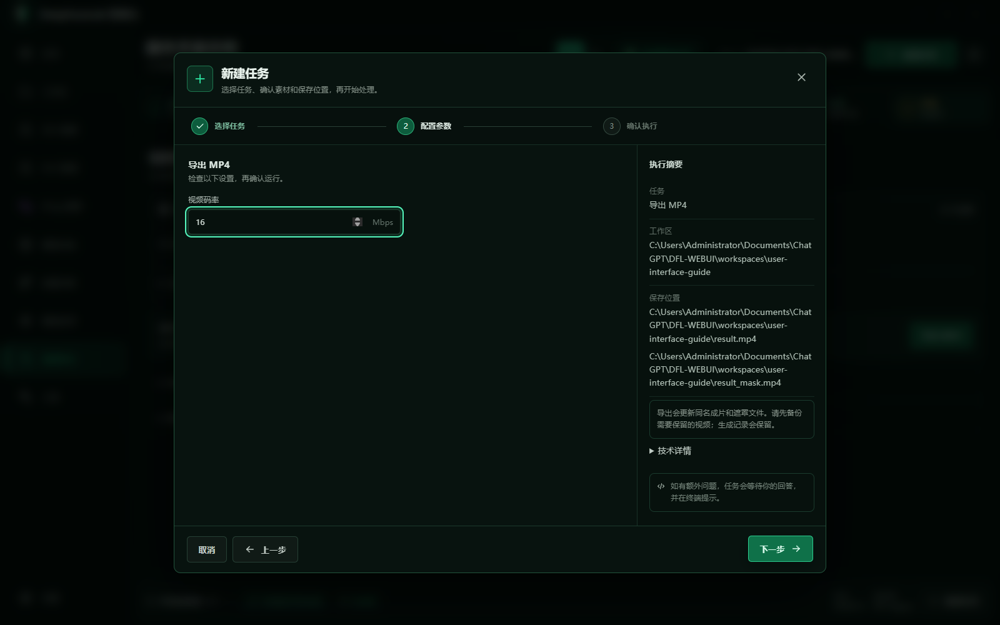

### 12.2 播放成片与遮罩 / Play the result and mask

- **合成视频 / Merged video**：播放 `result.mp4`，检查画面是否完整、替换人物是否正确、嘴眼和轮廓是否稳定，并检查原视频音频是否同步。
- **遮罩视频 / Mask video**：选择 `result_mask.mp4`，黑白画面用于检查替换范围、边缘和遮挡，不是普通成片。
- **打开文件夹 / Open folder**、**复制路径 / Copy path**：定位当前选中的成果。需要保留当前版本时，先另存，再重新合成或导出。

- **合成视频 / Merged video**: play `result.mp4` and inspect completeness, the intended person, eye and mouth motion, edge stability, and original-audio synchronization.
- **遮罩视频 / Mask video**: select `result_mask.mp4` to inspect replacement coverage, edges, and occlusions in black and white. It is a diagnostic output.
- **打开文件夹 / Open folder** and **复制路径 / Copy path** locate the selected output. Save a separate copy before merging or exporting again if you need to preserve this version.

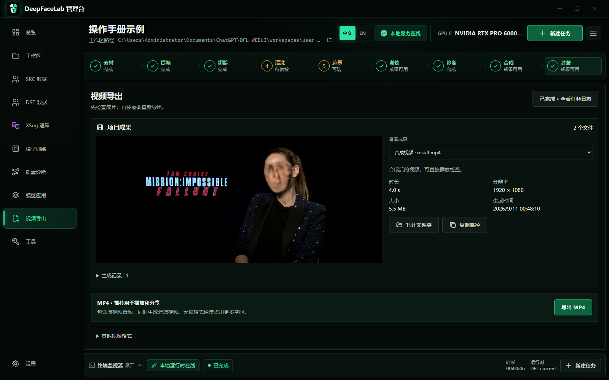

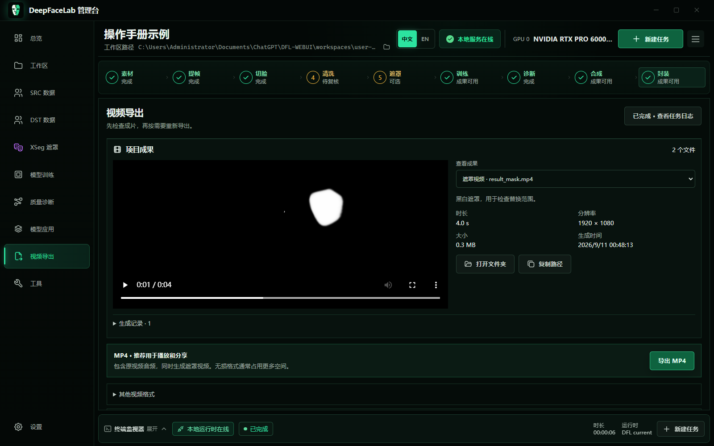

本文结果为 **4 秒、25 fps、1920 × 1080、100 帧**；普通成片含 H.264 视频和 AAC 音轨，遮罩视频含 H.264 视频。示例训练时间短，画面仍明显模糊，只证明操作链条与导出有效，不能作为画质达标样例。

The recorded output is **4 seconds, 25 fps, 1920 × 1080, and 100 frames**. The normal result contains H.264 video and an AAC audio track; the mask contains H.264 video. The short training run remains visibly blurry. It verifies the workflow and export, not acceptable production quality.

### 12.3 生成记录与其他格式 / Generation history and other formats

展开 **生成记录 / Generation history**，核对生成时间和任务参数；任务日志尚未归档时，可打开对应日志。记录会保留任务和参数，但历史视频可能已经被后续同名导出更新，不代表每次成片都另存了一份。

Expand **生成记录 / Generation history** to inspect timestamps and parameters. Open the associated log while it remains available. History preserves the task and settings, but later exports may overwrite the same video files; it does not guarantee a separate historical video for each entry.

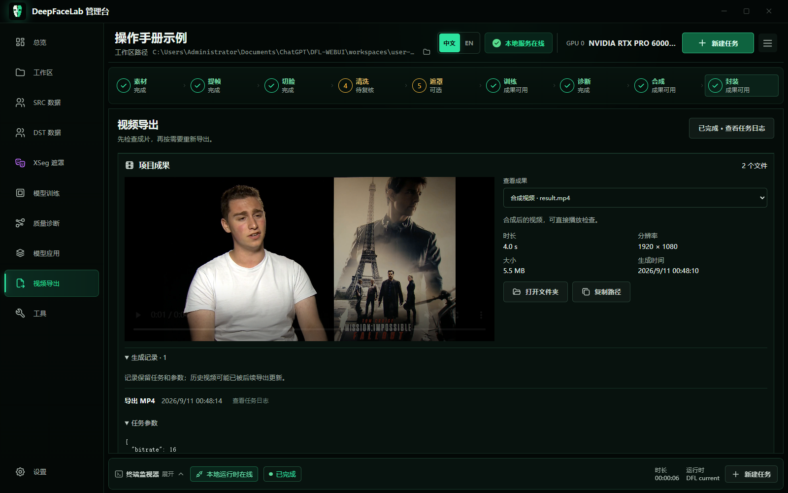

需要其他格式时，展开 **其他视频格式 / Other video formats**，选择无损 MP4、AVI 或无损 MOV，再按对应向导操作。**模型导出（DeepFaceLive） / Model export (DeepFaceLive)** 生成的是模型文件，供其他应用使用，与成片视频导出分开。

Expand **其他视频格式 / Other video formats** for lossless MP4, AVI, or lossless MOV, and follow the corresponding wizard. **模型导出（DeepFaceLive） / Model export (DeepFaceLive)** creates a model file for another application and is separate from video encoding.

## 13. 工具箱 / Tool reference

点击左侧 **工具 / Tools** 后，顶部切换为工具标签。先核对 SRC / DST，再执行读取、检查或处理操作。工具是独立工作台，可按当前问题选择使用。

Select **工具 / Tools** in the sidebar to open the tool tabs. Check SRC / DST before reading, inspecting, or processing data. These are independent workbenches; use the one relevant to the current issue.

| 工具 / Tool | 适用场景与操作 / When and how to use it |
| --- | --- |
| 数据审计 / Data audit | 按清晰度、曝光、遮罩和重复来源筛选，再人工复核或隔离；参见第 6 节。 / Filter by sharpness, exposure, masks, and duplicate sources, then review or quarantine; see section 6. |
| 相似组清洗 / Similarity cleaning | 分析候选组，明确保留代表图，再将已复核的冗余项移入可恢复隔离区。 / Analyze candidate groups, choose a representative, then quarantine reviewed redundant samples. |
| 按角色分组 / Group by person | 选择、命名、复核人物并保留或分配到 SRC / DST；参见第 6 节。 / Select, name, review, and retain or assign people to SRC / DST; see section 6. |
| 提取复核 / Extraction review | 核对源帧上的提取框和关键点，筛选未提取或多人脸帧。对齐修复先预览再提交。 / Check extraction boxes and landmarks on source frames; filter missing or multi-face frames. Preview alignment repairs before committing. |
| 合成复核 / Merge review | 同步检查原帧、合成帧和遮罩，发现缺失后回到合成；参见第 11 节。 / Inspect originals, merged frames, and masks together; return to Merge if outputs are missing. See section 11. |
| 视频时间线 / Video timeline | 分析镜头切点、选择片段、预览时间范围，再按片段提帧；也可查看帧归档恢复入口。 / Analyze shot boundaries, select segments, preview ranges, and extract frames from selected segments; frame-archive recovery is also available. |
| 元数据与打包 / Metadata & packing | 检查 DFL 元数据覆盖和 faceset 包状态；从按钮进入保存元数据、恢复、打包或解包任务。 / Inspect DFL metadata coverage and faceset package status; open metadata save/restore or pack/unpack tasks. |
| 模型导出 / Model export | 检查模型组件是否齐全，再进入对应 DFM 导出向导。 / Check model components, then open the appropriate DFM export wizard. |
| 姿态图谱 / Pose atlas | 先看 SRC / DST 角度覆盖差，再查看具体样本；参见第 6 节。 / Compare SRC / DST pose coverage, then inspect individual samples; see section 6. |
| 图像工具 / Image tools | 从素材检查器带入选中人脸。标明“规划中”的增强或 AI 编辑功能只展示入口，没有实际处理。 / Open the selected face from its inspector. Enhancement or AI-edit features marked as planned show an entry only and do not process an image. |
| 覆盖清单 / Coverage map | 查看哪些能力已在 Web 中实现、哪些仍需原工具或终端。 / Check which capabilities run in the WebUI and which still require the original tool or terminal. |
| 命令目录 / Command catalog | 搜索固定任务，核对描述与参数后进入向导。 / Search registered tasks, inspect their descriptions and parameters, and open the wizard. |

### 13.1 视频时间线 / Video timeline

选择 SRC / DST，运行镜头分析，点击片段预览并核对起止时间。仅分析不会改动视频；按片段提帧会改变当前源帧集合，执行前查看归档范围和恢复说明。本次只录制分析与预览，没有替换已经用于训练的帧集合。

Choose SRC / DST, analyze shots, and select a segment to preview its start and end. Analysis does not modify the video. Segment extraction changes the current source-frame set, so review the archive scope and recovery information first. This recording demonstrates analysis and preview without replacing the frames used for training.

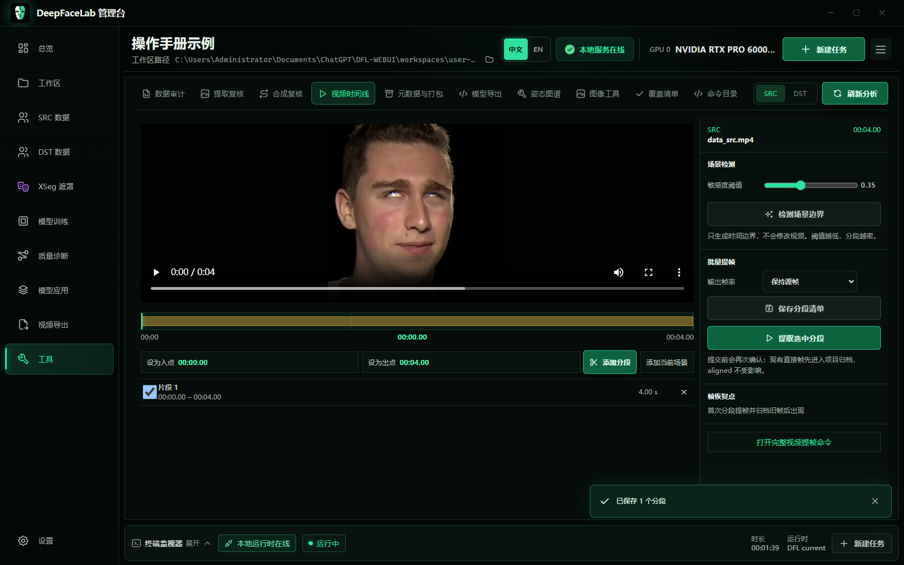

### 13.2 元数据、打包和模型导出 / Metadata, packing, and model export

元数据检查用于确认人脸仍保留源帧、关键点和遮罩等信息。打包适合整理或搬运 faceset；恢复元数据或解包前，核对任务作用的侧别和目录。仅打开检查页不会执行这些写入操作。

Metadata inspection checks whether aligned faces retain source-frame, landmark, and mask information. Packing helps organize or transfer a faceset. Before restoring metadata or unpacking, check the dataset side and directory. Opening the inspection page does not perform those writes.

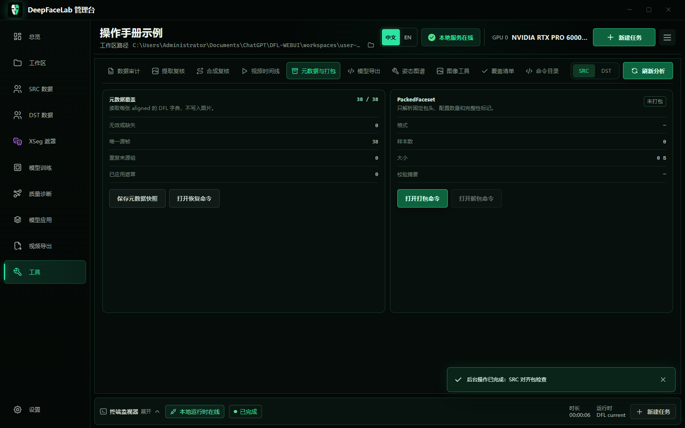

模型导出页的“就绪”表示通过组件预检；点击 **打开 DFM 导出 / Open DFM export** 后仍需确认模型和运行参数。本次未执行 DFM 导出，也未验证 DeepFaceLive 加载。

Ready on Model export means the component preflight passed. **打开 DFM 导出 / Open DFM export** still opens a wizard requiring model and runtime settings. This recording did not export a DFM or verify loading it in DeepFaceLive.

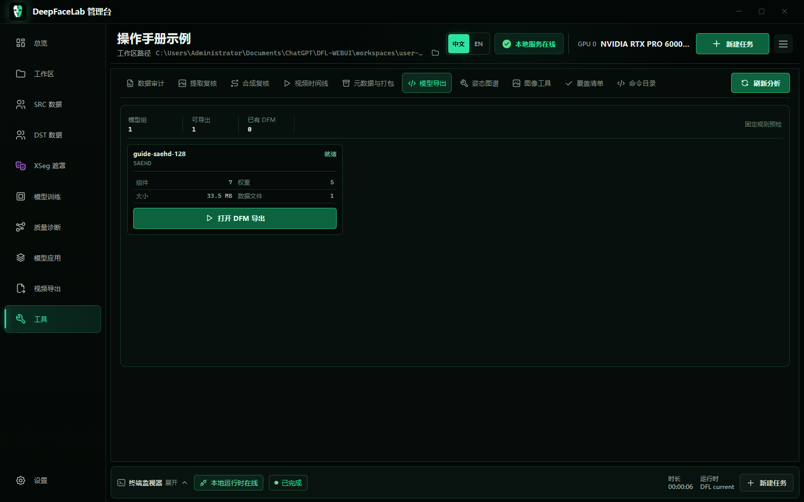

## 14. 任务、连接与故障恢复 / Tasks, connections, and recovery

### 14.1 先辨认任务状态 / Identify the task state first

| 看到的状态 / State | 接下来怎么做 / Next action |
| --- | --- |
| 等待输入 / Waiting for input | 展开终端，阅读最后一个问题，逐项发送回答；参见第 4、8 节。 / Expand the terminal, read the last prompt, and answer one question at a time; see sections 4 and 8. |
| 运行中 / Running | 观察真实输出与进度。训练达到估算目标后仍会运行。 / Follow real output and progress. Training continues beyond its estimate target. |
| 已完成 / Completed | 核对实际文件和播放或预览结果。 / Check actual files and their playback or preview. |
| 已安全停止 / Stopped safely | 保留模型和历史；需要时继续训练。 / Keep the saved model and history; resume when needed. |
| 连接已丢失 / Connection lost | 先检查本地服务和进程状态；不能据此断定任务成功或模型已保存。 / Check the local service and process state; this does not prove success or a saved model. |
| 失败 / Failed | 阅读终端错误，解决原因后从设置或任务入口重试。 / Read the terminal error, fix the cause, and retry from Settings or the task entry. |
| 前置检查失败 / Preflight failed | 保留当前向导，修复素材、模型、运行库或资源占用问题，然后重新检查。 / Keep the wizard open, resolve missing inputs, runtime, or resource conflicts, and recheck. |

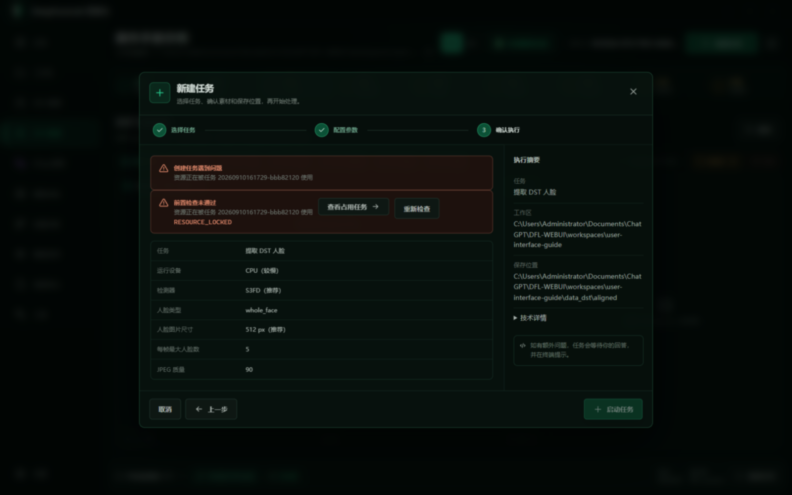

### 14.2 刷新、重连与重试 / Refresh, reconnect, and retry

- 浏览器刷新后会重新读取服务和任务；刷新网页不等于停止底层任务。服务重启后，无法恢复的进程会话可能显示失联，先检查状态再重试。
- 长时间后台操作若连接异常，使用卡片提供的 **检查状态 / Check status**。没有最终结果时，不要连续重复提交同一个写入。
- 在 **设置 → 任务恢复 / Settings → Task recovery** 中点击对应记录的 **重试 / Retry**，会重新打开带有参数的任务向导；核对素材与输出范围后再启动。
- 更换视频后，从工作区对应侧的 **恢复历史 / Recovery history** 检查旧素材。人脸隔离从数据集 **恢复区 / Recovery area** 恢复；不要把两种恢复入口混用。
- “清洗：待复核”重新出现时，通常是素材或 JPG 元数据已变化，原人物复核记录不再对应当前文件。重新分析并确认人物即可；保存 XSeg 标签后也可能触发。

- Reloading the browser reconnects to service and task state; it does not stop the underlying job. After a service restart, unrecoverable process sessions may appear lost. Check status before retrying.
- If a background operation loses connection, use its **检查状态 / Check status** action. Avoid repeatedly submitting the same write while its outcome is unknown.
- **设置 → 任务恢复 / Settings → Task recovery → 重试 / Retry** reopens a task wizard with saved parameters. Check inputs and output scope before starting.
- Use the relevant video's **恢复历史 / Recovery history** in Workspace for replaced media. Use the dataset **恢复区 / Recovery area** for quarantined faces; these are separate recovery mechanisms.
- Cleaning may return to Needs review after material or JPG metadata changes because the previous person review no longer matches the files. Analyze and confirm the selection again. Saving XSeg labels can also cause this.

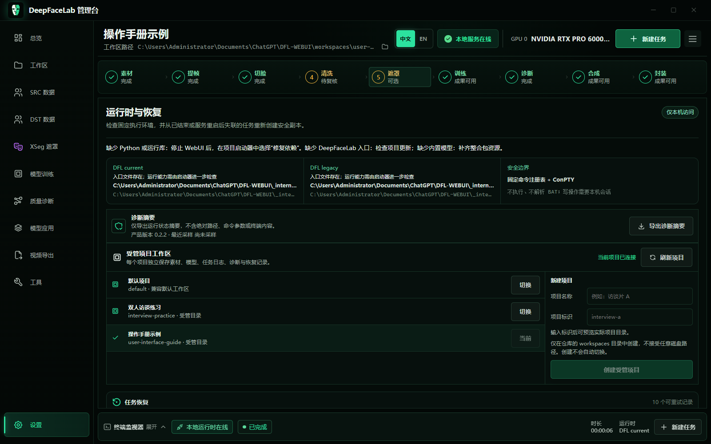

### 14.3 运行时检查与日志整理 / Runtime checks and log housekeeping

打开 **设置 / Settings**，查看 current / legacy 入口和 **诊断摘要 / Diagnostic summary**。缺少 Python 或运行库时，停止 WebUI 后在启动器选择“修复依赖”；缺少项目入口文件时检查项目更新。入口文件存在不代表 GPU 兼容性已经验证。

Open **设置 / Settings** to inspect current / legacy runtime entries and the Diagnostic summary. If Python or runtime libraries are missing, stop WebUI and use Repair dependencies in the launcher. Check project updates for missing entry files. An existing entry file does not itself verify GPU compatibility.

终端的“清理已结束”用于整理会话标签；工作区的“归档已完成任务”用于归档已结束任务日志。它们不是删除素材、模型或成片。归档前先保存需要保留的日志，生成记录仍应与实际成果文件分别核对。

Clear finished in the terminal organizes session tabs. Archive completed tasks in Workspace archives completed job logs. These actions do not delete datasets, models, or result videos. Save any logs you need before archiving, and check generation records separately from the actual output files.

## 15. 本次录制结果与范围 / Recording results and scope

本手册使用独立示例项目，按界面实际操作完成下列主流程。截图保留真实素材、训练预览和导出状态，没有用模拟训练结果替换。

This guide uses a separate example project and completes the main workflow through the real interface. Screenshots retain actual material, training previews, and export states; simulated training results were not substituted.

| 检查项 / Check | 录制结果 / Recorded result |
| --- | --- |
| 项目 / Project | `操作手册示例 · user-interface-guide` |
| SRC / DST 视频 / Videos | 同一段已有访谈素材，分别导入 / Same existing interview clip, imported on both sides |
| 视频帧 / Frames | SRC `100`，DST `100` |
| 初次提取 / Initial extraction | SRC `138`，DST `138` aligned JPG |
| 人物复核后 / After person review | SRC 男士 `38`，DST 女士 `62` / SRC man `38`, DST woman `62` |
| 可恢复隔离 / Recoverable quarantine | 非所选人物分别隔离 `100 / 76` 张；另实际隔离并恢复 1 张 SRC，文件哈希一致 / `100 / 76` non-selected faces quarantined; one additional SRC face quarantined and restored with an identical file hash |
| XSeg 手绘 / Manual XSeg | DST `00039_0.jpg` 保存 1 个 17 点多边形，重新读取成功 / One 17-point polygon saved to DST `00039_0.jpg` and read back |
| SAEHD | 新模型 `guide-saehd-128`，128px，CPU / New model `guide-saehd-128`, 128px, CPU |
| 安全停止与续训 / Safe stop and resume | 第一次 `2,630` 次，续训后 `3,654` 次；两次均正常保存退出 / First stop at `2,630`, resumed stop at `3,654`; both saved and exited normally |
| 质量诊断 / Diagnostics | 4 次真实快照；图示比较 `3,027 → 3,445` / Four real snapshots; illustrated comparison `3,027 → 3,445` |
| 合成序列 / Merged sequences | `100` 张合成帧 + `100` 张遮罩 / `100` merged frames + `100` masks |
| 视频导出 / Video export | 成片与遮罩均为 4 秒、100 帧、25 fps、1920×1080；成片含音轨 / Both outputs are 4 seconds, 100 frames, 25 fps, 1920×1080; normal output includes audio |
| 页面播放 / Browser playback | 成片可播放、时间推进；两类视频均载入成功，无媒体错误 / Normal video played with advancing time; both outputs loaded without media errors |

**本次修复 / Fixes made while recording:** 首次导入误称“替换”；部分终端问题未显示等待输入；重复选中人脸导致预览停在加载状态；XSeg 工具栏按钮文字挤压；训练提示卡遮挡安全停止；训练预览红蓝通道交换；诊断中的模型名截断与换脸图片标题错误。修复后从对应步骤继续录制。

The recording led to fixes for first-import replacement wording, missed terminal input prompts, a preview loading stall when reselecting a face, cramped XSeg toolbar labels, a training status card blocking Safe stop, swapped red/blue preview channels, and incorrect model-name truncation and swap-image labels in Diagnostics. Recording resumed from the affected steps after each fix.

**未覆盖范围 / Outside this recording:** 长时间高质量训练、GPU 训练兼容性、独立 XSeg 训练与批量应用、其他模型家族、手动提取外部窗口、faceset 打包或元数据恢复写入、DFM 导出及 DeepFaceLive 加载。工具章节对这些入口作说明，不代表本次已经逐项运行。成片音轨存在已验证，听感与音画同步仍需人工验收。

The recording does not cover long production-quality training, GPU training compatibility, separate XSeg training and batch application, other model families, external manual-extraction windows, faceset packing or metadata-restoration writes, DFM export, or DeepFaceLive loading. Those tool entries are documented without claiming execution. Audio-track presence was verified; listening quality and synchronization still require human review.

### 15.1 界面与修复验证 / Interface and fix verification

验证环境为本机 `http://127.0.0.1:4173`，Windows Chrome；主要截图为 1600×1000，另以 1440×900 检查按钮可达性和浏览器回归。当前会话没有 Browser 插件，因此使用已安装的 Playwright 与 Chrome 录制。移动端未作为本次工作台手册的验收范围。

Validation used local `http://127.0.0.1:4173` in Chrome on Windows. Main screenshots are 1600×1000; button reachability and browser regression were also checked at 1440×900. The Browser plugin was unavailable, so recording used the installed Playwright and Chrome. Mobile layouts were outside the acceptance scope of this workstation guide.

| 验证 / Verification | 结果 / Result |
| --- | --- |
| 页面身份、有效内容 / Page identity and content | 通过：正确地址与标题、工作区和成果可读取 / Passed: correct URL and title, readable workspace and outputs |
| 错误遮罩与脚本异常 / Error overlays and script errors | 最终检查通过：无框架错误遮罩、无页面或控制台错误 / Final check passed: no framework overlay, page errors, or console errors |
| 浏览器交互 / Browser interactions | 通过：刷新与向导、断线恢复、姿态对比、重复选择和未保存 XSeg 草稿 / Passed: refresh and wizard, reconnection, pose comparison, reselecting a face with an unsaved XSeg draft |
| 训练控制 / Training controls | 实际界面验证：保存停止、继续同一模型、刷新预览、生成诊断快照；1440 和 1600 宽度可点击停止 / Exercised in the UI: save and stop, resume the same model, refresh preview, create snapshots; stop reachable at widths 1440 and 1600 |
| 自动化回归 / Automated regression | 11 项通过，1 项旧的可写训练场景跳过；本次真实训练路径由上述录制单独验证 / 11 passed, 1 legacy mutating training scenario skipped; the actual training path was verified separately in this recording |
| 修复专项 / Focused checks | 终端提问识别、预览颜色 PNG 回读、诊断比较规则通过；中英文 XSeg 按钮无溢出 / Prompt detection, preview PNG color round-trip, and diagnostic comparison rules passed; Chinese/English XSeg controls fit |
| 构建 / Build | 通过 / Passed |

开发者复验入口：在 `webui` 目录运行 `npm run build`；浏览器检查为 `npm run test:e2e`。本次专项检查使用 `output-parser-prompts.test.mjs`、`trainer-preview.test.mjs` 和 `training-pose-regression.test.mjs`。已有运行中的任务应先正常结束，再执行需要修改素材的测试。

For developers, run `npm run build` from `webui`; the browser checks use `npm run test:e2e`. Focused checks are in `output-parser-prompts.test.mjs`, `trainer-preview.test.mjs`, and `training-pose-regression.test.mjs`. Finish active jobs before running tests that modify material.
