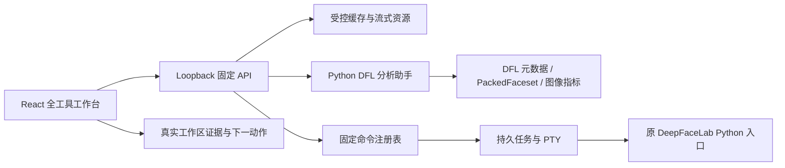

# 全工具工作台：需求、架构与验收计划

## 1. 需求挖掘结论

现有 WebUI 已经覆盖 53 个固定命令、任务恢复、终端、工作区状态、数据集浏览、XSeg 标注、SAEHD 训练预览、引导式合成和姿态图谱。缺口不在“有没有按钮”，而在旧工具中最需要判断的环节仍然依赖终端、外部窗口或不可审计的批处理。

本轮以六类用户决策为中心：

| 决策场景 | 原工具 | Web 原生目标 | 后端目标 | 完成定义 |
| --- | --- | --- | --- | --- |
| 数据清洗与排序 | Sorter | 缩略图、质量指标、筛选、可恢复隔离 | 非破坏式评分清单 | 不执行重命名也能复核排序结果 |
| 手动提取复核 | Manual Extractor | 帧浏览、检测覆盖层、遗漏定位、固定命令接力 | 单帧/批次预检接口与缓存 | Web 可完成预检；精修仍可无损进入原工具 |
| 合成复核 | Interactive Merger | 原帧/合成/遮罩同步步进与缺失提示 | 安全帧流和合成产物索引 | 不打开文件夹即可逐帧验收 |
| 视频编辑 | VideoEd | 素材元数据、时间线、输入输出预检 | ffprobe 解析和固定媒体流 | 能确定素材、时长、分辨率和下一固定命令 |
| 元数据与打包 | Util / PackedFaceset | 元数据覆盖、异常、PAK/ZIP 摘要 | DFL 元数据审计、包头解析 | 检查调用零写入，异常可定位到样本 |
| 模型导出 | ExportDFM | 模型家族、组件、大小、就绪度 | 固定规则导出预检 | 导出前明确阻塞项和推荐命令 |

## 2. 范围分层

### A. Web 原生完成

- 数据集质量评分、排序、筛选、详情和可恢复隔离。
- SRC / DST 姿态占比对比、关键缺口标记，以及单库数量/清晰度复核。
- 视频素材检查和合成产物逐帧复核。
- DFL 元数据覆盖率、异常样本、PackedFaceset 结构和模型导出预检。
- 所有工具的支持状态、输入依赖、输出证据和下一动作。

### B. Web 预检 + 固定命令接力

- Manual Extractor 的 GPU 人脸检测与人工精修。
- Interactive Merger 的模型实时重算和逐参数预览。
- PackedFaceset 的写入/解包、元数据恢复等会大规模改写文件的操作。

这些流程不会伪装成 Web 已完全取代原工具。Web 负责定位、预检和承接上下文；原始窗口或固定命令负责目前仍依赖 GPU 常驻模型、OpenCV 窗口键位或大规模写入的部分。

## 3. 技术架构

职责边界：

- Python：解析 DFLJPG/DFLPNG、计算图像质量、聚合元数据、检查打包格式；输出版本化 JSON。
- Node：固定路径映射、并发/超时/输出上限、缓存、Range 流媒体、异常标准化。
- React：分阶段加载、空态/错误态、排序筛选、同步帧复核、命令接力，不复刻 Python 领域逻辑。

## 4. 安全与性能预算

- 检查接口只读；隔离/恢复沿用现有可恢复操作。
- 单次 Python 响应上限 4 MiB；审计单页最多扫描 500 张，前端以 120 张翻页，提取/合成复核以 60 帧翻批；昂贵分析使用 30 秒短缓存，元数据写入、隔离和恢复会主动失效。
- 只接受 `src` / `dst` 和固定资源槽，不暴露任意相对路径。
- 图片指标使用缩略尺寸计算；长列表默认最多展示 120 项。
- UI 不轮询静态审计结果；用户触发刷新，任务状态沿用现有运行时更新。

## 5. 验收清单

- Python/Node 集成测试覆盖真实 DFL 元数据、有界分页、恶意 pickle 不执行、第 501 帧提取覆盖、空 PackedFaceset 和模型组件缺失。
- API 测试覆盖路径拒绝、合成复核分页上限、媒体 Range、固定复核槽、错误映射和会话写保护。
- React 构建无错误；关键工作台交互至少覆盖加载、成功、空态、失败和窄屏。
- 使用真实 `workspace` 完成桌面与移动端截图审查；记录并修复首轮偏差，再完成一次终审。
- 搜索并清理旧 logo、生成概念残留、临时截图、死代码和无引用资源。
- 代码审查通过后再提交并推送当前 `codex/tool-lab-cleanup` 分支。
