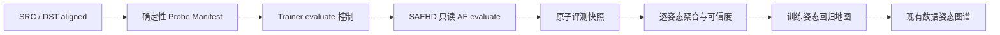

# 训练姿态回归地图技术方案

## 1. 决策与目标

数据姿态图谱与训练姿态回归地图并存，但职责不同：

| 能力 | 使用阶段 | 比较对象 | 回答的问题 |
| --- | --- | --- | --- |
| SRC / DST 姿态图谱 | 训练前 | 两个数据集 | 素材覆盖是否完整、分布是否匹配 |
| 训练姿态回归地图 | 训练中 | 同一模型的两个评测快照 | 哪些姿态进步、停滞或退化 |

两张地图必须使用同一组 Yaw × Pitch 分箱，并支持从回归格跳转到数据图谱检查对应素材。回归地图不能把全局训练损失复制到每个姿态格，也不能把没有依据的视觉变化描述为模型质量提升。

本方案只确定数据、评测和安全架构。2026-08-02 生成的三张训练界面草稿均未被采纳，不作为实现目标。

## 2. 当前可复用能力

现有代码已经提供以下基础：

- `WebTrainerBridge` 通过固定 JSONL 控制文件接收 `save`、`backup`、`preview`、`close`，并原子写入 Web 预览。
- Trainer 在模型线程中持有真实 SAEHD 实例，能安全调用 `model.get_previews()`、`model.get_loss_history()` 和原始保存流程。
- SAEHD 训练图已经暴露不更新权重的 `AE_view` 推理函数，可返回 SRC 重建、DST 重建、DST 遮罩、换脸输出和换脸遮罩。
- `ModelBase.sample_for_preview` 会随模型数据保存，现有 preview-history 证明“固定样本跨迭代比较”在 DFL 内部可行。
- `JobManager` 已有任务目录、原子元数据、事件流、控制白名单和预览文件监听。
- 姿态图谱已经从真实 DFL landmarks 生成 13 × 9 的 Yaw × Pitch 分箱。

现有 `sample_for_preview` 只包含一个训练 batch，不能覆盖全部姿态，因此不能直接作为回归地图的评测集。新能力应复用它的确定性思路，而不是复用它的样本范围。

## 3. 范围与非目标

### 第一版包含

- 为每个模型生成不可变、可校验的姿态分层评测集。
- 在训练线程内执行只读推理，不更新权重。
- 保存同一评测集在不同迭代的输出和逐样本指标。
- 按姿态格聚合基线与当前快照的变化、样本数和置信度。
- 展示 SRC 重建、DST 重建和换脸稳定性三个独立视角。
- 从回归格跳转到现有 SRC / DST 姿态图谱。

### 第一版不包含

- 不复制或归档完整模型权重；快照指评测结果，不是模型备份。
- 不引入 MVE 的 DFL fork 或 `--gen-snapshot` 协议。
- 不声称无参考换脸结果存在绝对“真实质量分”。
- 不自动删除旧快照。
- 不把身份相似度纳入默认结论，直到本地特征模型通过专项验证。
- 不实现未被用户选中的训练界面草稿。

## 4. 总体架构



建议新增边界明确的模块：

- `webui/python/pose_bins.py`：Yaw/Pitch 分箱的唯一 Python 来源。
- `webui/python/dfl_pose_probe.py`：生成并校验评测 manifest，只读取固定 aligned 目录。
- `_internal/DeepFaceLab_old/models/Model_SAEHD/` 内的只读评测入口：复用已加载模型和 `AE_view`，不经过优化器。
- `webui/server/training-evaluation-manager.mjs`：索引 manifest、快照和公开 API，不解析任意路径。
- `webui/src/domain/pose-regression.js`：纯函数计算基线/当前差值、状态和置信度。

姿态图谱和评测 manifest 必须共用分箱定义，避免两个功能在边界角度上给出不同格子。

## 5. 固定评测集

### 5.1 生成规则

评测集按 SRC、DST 分别生成，规则必须确定性：

1. 读取有效 DFL metadata、landmarks、来源文件名和图像摘要。
2. 使用统一 Yaw/Pitch ticks 分箱。
3. 每个有素材的格先选 1 张，保证姿态覆盖。
4. 再按格内素材量补到最多 3 张，同时对每侧设置全局上限 180 张。
5. 优先选择接近格内清晰度中位数的样本，避免只选最好或最差素材。
6. 同一 `sourceFilename` 在一个格内最多保留 1 张，降低连续帧重复偏差。
7. 所有并列结果以安全相对文件名排序，保证重新扫描得到同一选择。

样本不足时不伪造数据：1 张为观察级，2 张为低置信，3 张及以上才允许输出稳定颜色。

### 5.2 Manifest 数据

```json
{
  "schemaVersion": 1,
  "manifestId": "sha256-prefix",
  "modelKey": "web-smoke-128_SAEHD",
  "createdAt": "2026-08-03T00:00:00.000Z",
  "poseBins": {
    "yaw": [-90, -75, -60, -45, -30, -15, 0, 15, 30, 45, 60, 75, 90],
    "pitch": [60, 45, 30, 15, 0, -15, -30, -45, -60]
  },
  "datasets": {
    "src": { "fingerprint": "...", "sampleCount": 90 },
    "dst": { "fingerprint": "...", "sampleCount": 90 }
  },
  "samples": [
    {
      "id": "src-p0-y15-01",
      "side": "src",
      "name": "000001_0.jpg",
      "sha256Prefix": "...",
      "sourceFilename": "000001.png",
      "cellId": "p0-y15",
      "yaw": 15,
      "pitch": 0,
      "sharpness": 0.42
    }
  ]
}
```

浏览器不能提交文件路径或修改 manifest。服务端只根据当前工作区和训练任务参数解析 `modelKey`。任一样本缺失、摘要变化或分箱版本变化时，旧 manifest 保留只读，但不能继续写入新快照；用户需要显式生成新评测集。

## 6. 只读模型评测

### 6.1 Trainer 控制

控制白名单增加 `evaluate`，同时增加两个由 CommandRegistry 固定设置的环境变量：

- `DFL_WEB_EVAL_MANIFEST=<固定 manifest 路径>`
- `DFL_WEB_EVAL_ROOT=<固定模型评测目录>`

JSONL 仍只接受操作枚举，不接受浏览器传入的 executable、argv 或路径。`evaluate` 只在一次训练迭代结束后执行，和 `save`、`preview` 一样通过 Trainer 原有队列串行进入模型线程。

训练命令 preflight 根据固定的 SRC/DST aligned 槽位创建或复用 manifest，再把已解析路径写入启动环境。manifest 生成失败不应阻止正常训练，但该任务的 `evaluate` 控制必须保持禁用并返回明确原因；运行中的 Trainer 不接受临时替换 manifest。

### 6.2 模型入口

SAEHD 增加不更新权重的 `evaluate_pose_probes()`：

1. 校验 manifest 与模型分辨率、face type 和数据摘要。
2. 使用 `SampleLoader` 读取 manifest 指定样本。
3. 使用关闭随机翻转、随机旋转、缩放、平移和颜色迁移的固定预处理。
4. 按模型 batch size 分批调用只读推理图。
5. 输出输入、SRC/DST 重建、换脸结果、目标遮罩和预测遮罩。
6. 在 NumPy/OpenCV 中计算稳定指标。
7. 先写临时目录和临时 JSON，完成后原子改名。

禁止调用训练优化器；评测前后的模型迭代数和权重摘要必须相同。测试应把“评测不会增加迭代、不改变模型文件”作为硬断言。

## 7. 指标口径

### 7.1 第一版原始指标

| 指标 | 适用输出 | 方向 | 含义 |
| --- | --- | --- | --- |
| `maskedMse` | SRC/DST 重建 | 越低越好 | 人脸有效区域的像素重建误差 |
| `eyesMouthMse` | SRC/DST 重建 | 越低越好 | 眼睛和嘴部关键区域误差 |
| `maskDice` | DST/换脸遮罩 | 越高越好 | 预测遮罩与固定目标遮罩的一致性 |
| `sharpnessRatio` | 重建/换脸 | 接近并稳定 | 输出清晰度相对输入的比例 |
| `outputDelta` | 相邻快照换脸输出 | 仅描述变化 | 两次快照输出的变化幅度，不代表自动改善 |

`outputDelta` 只能提示“这个格发生了显著变化”，不能单独标记为进步或退化。

### 7.2 三个地图视角

- `SRC 重建`：以 `maskedMse`、`eyesMouthMse` 为主，观察身份素材表征是否退化。
- `DST 重建`：以 `maskedMse`、`eyesMouthMse`、`maskDice` 为主，观察目标姿态和结构保真。
- `换脸稳定性`：展示 `maskDice`、`sharpnessRatio` 和 `outputDelta`，第一版不输出绝对质量结论。

默认视角为 `DST 重建`，因为回归格的姿态来自 DST 输入。SRC 指标按 SRC 自己的姿态格聚合，不能和 DST 格内样本混算。

### 7.3 状态与置信度

每个指标先计算逐样本相对变化，再在格内取中位数，降低异常样本影响。第一版状态阈值在真实 SAEHD fixture 上校准后固化，并保存 `metricSchemaVersion`。

- `improved`：主要误差下降超过噪声阈值，且没有关键指标明显恶化。
- `stable`：变化位于噪声区间内。
- `regressed`：主要误差上升超过阈值，或关键区域/遮罩指标明显恶化。
- `insufficient`：有效样本不足，或基线/当前快照缺失对应样本。

置信度必须独立显示：

- 3 个及以上有效样本：`stable-evidence`。
- 2 个有效样本：`low-confidence`。
- 1 个有效样本：`observation-only`，格子使用弱化颜色。
- 0 个有效样本：不计算状态。

### 7.4 身份相似度准入门槛

仓库目前没有已验证的 ArcFace/FaceNet 特征模型。身份指标只能在以下条件全部满足后加入：

- 模型文件来自明确、可再分发的来源并保存在仓库约定目录。
- 固定正负样本基准能证明同身份/异身份分离度。
- 对模糊、遮挡、极端姿态的失败率有记录。
- CPU/GPU 开销符合本地工作台预算。
- UI 同时显示原始余弦相似度、阈值版本和低置信状态。

身份指标未通过门槛前，不参与格子颜色和任何综合结论。

## 8. 存储与生命周期

```text
workspace/.webui/training-evaluations/
  <model-key>/
    manifests/
      <manifest-id>.json
    snapshots/
      iter-00008000-<snapshot-id>/
        summary.json
        samples/
          <sample-id>/
            input.webp
            reconstruction.webp
            swap.webp
            target-mask.webp
            predicted-mask.webp
    index.json
```

要求：

- 输出根目录由服务端和 CommandRegistry 固定，浏览器不能指定。
- 快照写入 `_pending-<id>`，全部成功后原子改名；API 忽略 pending 目录。
- 同一迭代允许多个快照，但每个 `snapshotId` 唯一，绝不覆盖旧数据。
- 单侧最多 180 个 probe；图片按模型分辨率保存为本地 WebP。
- 默认最多保留 12 个在线快照；达到上限时停止自动采集并提示归档，不静默删除。
- 归档操作移动到 `.webui/archive/training-evaluations/`，保持可恢复。
- 快照只包含评测产物和指标，不包含完整模型权重。

训练重新启动时，只要 `modelKey`、manifest 和数据摘要一致，新 job 可以继续写入同一时间序列；不一致时创建新序列，不能跨 manifest 比较。

## 9. 服务端接口与事件

建议接口：

- `GET /api/training-evaluations/:modelKey/manifests`
- `GET /api/training-evaluations/:modelKey/snapshots`
- `GET /api/training-evaluations/:modelKey/snapshots/:snapshotId`
- `GET /api/training-evaluations/:modelKey/snapshots/:snapshotId/samples/:sampleId/:variant`
- `POST /api/jobs/:jobId/control`，固定 `operation: "evaluate"`
- `POST /api/training-evaluations/:modelKey/archive`，只接受快照 ID 枚举，不接受路径

WebSocket 复用 `job.artifact`：

```json
{
  "kind": "training-evaluation",
  "snapshotId": "iter-00012000-abcd1234",
  "iteration": 12000,
  "manifestId": "...",
  "metricSchemaVersion": 1
}
```

所有 ID 使用严格正则和服务端索引解析；图片接口禁止任意文件名和目录穿越。

## 10. 产品交互边界

- 数据姿态图谱继续位于工具实验室，默认比较 SRC / DST 数据覆盖。
- 姿态回归地图属于训练诊断，只在存在两个兼容快照时启用。
- 用户必须明确选择“基线快照”和“当前快照”；默认基线为上一个兼容快照。
- 地图轴、格 ID 和颜色语义保持稳定，但两个地图不能共用同一个“匹配率”。
- 回归格详情必须显示：原始指标、变化量、样本数、置信度以及输入/基线/当前的同样本对照。
- `查看数据原因` 跳转到现有姿态图谱并选中相同 `cellId`。
- 数据图谱中的 `开始训练诊断` 只负责导航，不自动启动训练或评测。

具体布局需要新的用户选择；本方案不复用已被否决的三个训练设计稿。

## 11. 性能与安全预算

- 评测与训练使用同一模型线程，避免并发访问 TensorFlow session；评测期间训练短暂停顿。
- 第一版只支持手动评测和“保存后评测”，不支持每 N 次迭代高频自动评测。
- 单次评测设置硬样本上限和批次数上限；达到 120 秒取消并保留失败状态，不发布半成品快照。
- 评测不修改 aligned 文件、模型权重或训练迭代。
- 不新增 shell、BAT 解析、客户端 argv 或客户端路径。
- 所有 JSON 和图片使用原子写入；单个 manifest、summary 和图片设置大小上限。
- 任务结束、服务重启或浏览器断线不会损坏已完成快照。

## 12. 避免冗余的实现原则

- 抽取唯一的姿态分箱定义，姿态图谱、manifest 和回归聚合共同使用。
- 评测指标只在 Python 端计算一次；React 只计算两个快照的纯差值和显示状态。
- 快照索引由 `training-evaluation-manager` 统一维护，`JobManager` 只发布任务事件。
- 复用现有 `AE_view` 输出，不复制一套模型推理网络。
- 复用现有任务控制、事件、原子写入和归档基础设施。
- 不把未展示的派生字段提前加入公共 API；每个字段必须有 UI、校验或明确的版本迁移用途。

## 13. 分阶段实施

### P0：数据契约与确定性

- 抽取共享姿态分箱。
- 实现 manifest 生成、摘要校验和 fixture 测试。
- 实现快照 schema、索引和只读 API fixture。

验收：同一数据集无论文件枚举顺序如何都生成相同 manifest；任何样本变化都会改变数据摘要。

### P1：SAEHD 只读评测

- 增加 `evaluate` 白名单操作和固定环境变量。
- 增加确定性预处理和 SAEHD `AE_evaluate`。
- 原子保存逐样本输出与原始指标。
- 增加真实 SAEHD 的可选 mutating/integration smoke test。

验收：评测前后迭代数、模型文件摘要和训练损失历史完全不变；中断评测不会暴露半成品快照。

### P2：回归聚合与地图

- 实现 `pose-regression.js` 纯函数和阈值版本。
- 实现快照选择、Yaw × Pitch 状态、置信度和同样本详情。
- 实现跳转现有姿态图谱并选中相同格。

验收：基线/当前样本严格对应；低样本格不会显示为高置信进步或退化；不同 manifest 无法比较。

### P3：身份指标研究

- 选择具备许可和本地部署条件的特征模型。
- 构造身份正负样本与极端姿态基准。
- 通过门槛后以独立指标上线；未通过则保持关闭。

## 14. 测试矩阵

- Python 单元：分箱边界、确定性抽样、去重、摘要变化、固定预处理、指标计算。
- 模型单元：评测图不包含 optimizer update；批次补齐不污染结果。
- Server 单元：控制白名单、路径边界、原子快照、pending 隐藏、跨 manifest 拒绝、归档可恢复。
- Domain 单元：中位数聚合、状态阈值、样本置信度、缺失样本。
- Browser E2E：选择两个快照、切换 SRC/DST/换脸视角、选中格、查看同样本、跳转数据图谱。
- 可选真实训练测试：启动 SAEHD、生成两个快照、确认迭代继续且模型文件未改变。

## 15. 完成定义

只有同时满足以下条件，姿态回归地图才能标记为 Web 原生完成：

- 固定评测集可重建、可校验、跨快照不漂移。
- 每个格子的结论可以追溯到同一批原始样本和原始指标。
- 评测不更新权重、不增加迭代、不修改数据集。
- 低样本、样本缺失和 manifest 变化都有明确的不可比较状态。
- 两张地图职责清晰且可以按同一 `cellId` 联动。
- 真实 SAEHD 集成测试、服务安全测试和浏览器交互测试通过。
